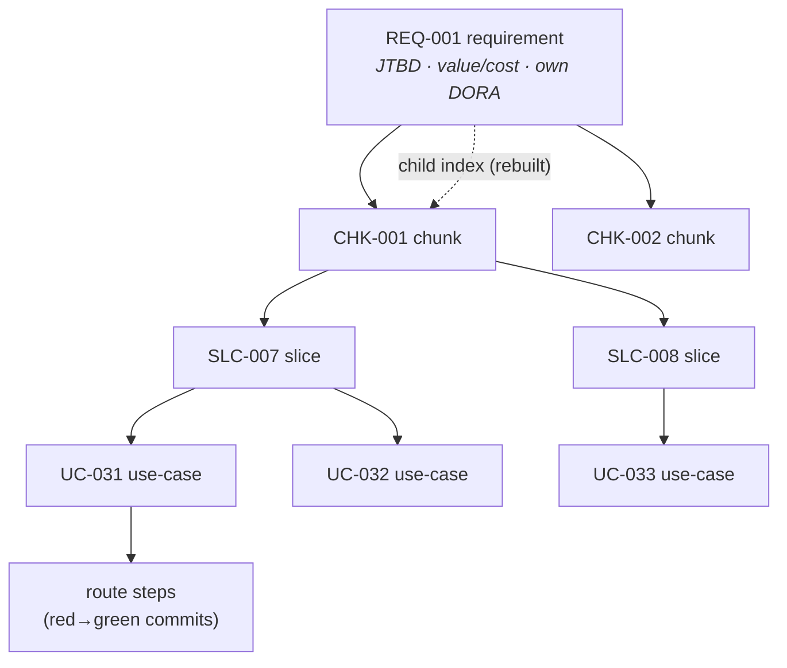
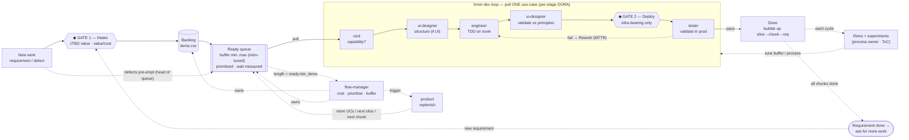
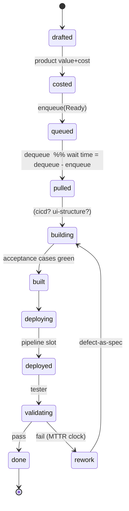
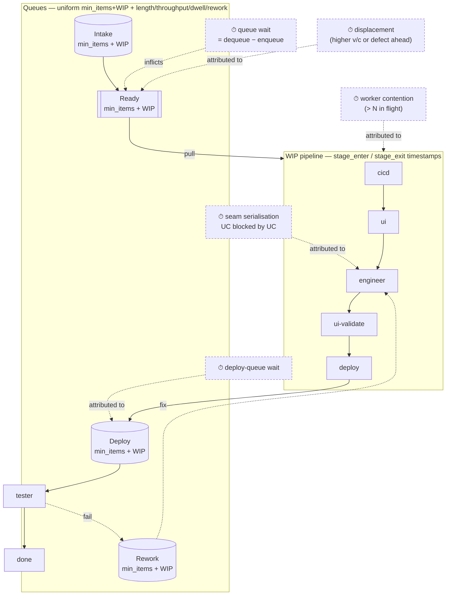
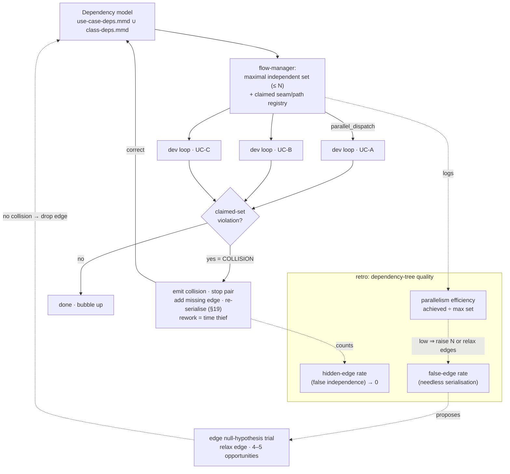

# Version 2 — Process diagrams

Loops, gates, and queues of the pull-based system. Mermaid source (renders on
GitHub and any mermaid viewer). An at-a-glance SVG overview was shown in chat; this
file is the durable, detailed set.

Legend across all diagrams: **◆ = human gate** (only two exist); dashed = control /
feedback; solid = work flow.

---

## 1. Work-item hierarchy & two-way links

Parent is canonical; the child index is rebuilt from parents on every mutation, so
the tree traverses both ways without drift. Every node carries its own DORA.

Done bubbles **up**: a slice is `done` when all its use-cases are `done`; a chunk
when its done-condition is met; a requirement when all chunks are `done` (→ ask for
more work). Lead time of any node = its first descendant `created` → its last
descendant `done`.

---

## 2. The full pull flow — loops, queues, gates

Two blocking gates only: **Intake** (value in) and **Deploy** for infra-bearing
change (risk out). Former gates 2 (slice) and 3 (arch+security) are replaced by
named assurances (see design §9), not removed blind.

---

## 3. Use-case lifecycle (state machine)

Every transition emits a ledger row, so the lifecycle *is* the measured flow.

---

## 4. Queues, handovers & where time is stolen

**Every queue uses the same model** — `min_items` + `wip_limit` knobs and the four
metrics length/throughput/dwell/rework (retro-tuned — design §3/§7b); the in-loop
stages are a WIP pipeline (timestamped, not buffered). Each labelled wait is a
**time thief**, attributed to its cause and ranked in the retro.

`dora.py` computes, per item: lead time = service time + Σ(these waits), with each
wait labelled by cause. The retro attacks the largest total (worked example in
`02-example-retro.md`).

---

## 5. Parallel pull & the dependency-tree learning loop (design §13)

The dispatcher fills capacity `N` with the maximal independent set; collisions
prove a declared independence false, correct the model, and feed two quality
metrics back to the retro.

Hidden edges are found by *running* concurrently and colliding; false edges are
found by *trialling* a relaxation and **not** colliding. Driving both toward zero
is the system learning to structure dependency trees that are neither over- nor
under-connected.
