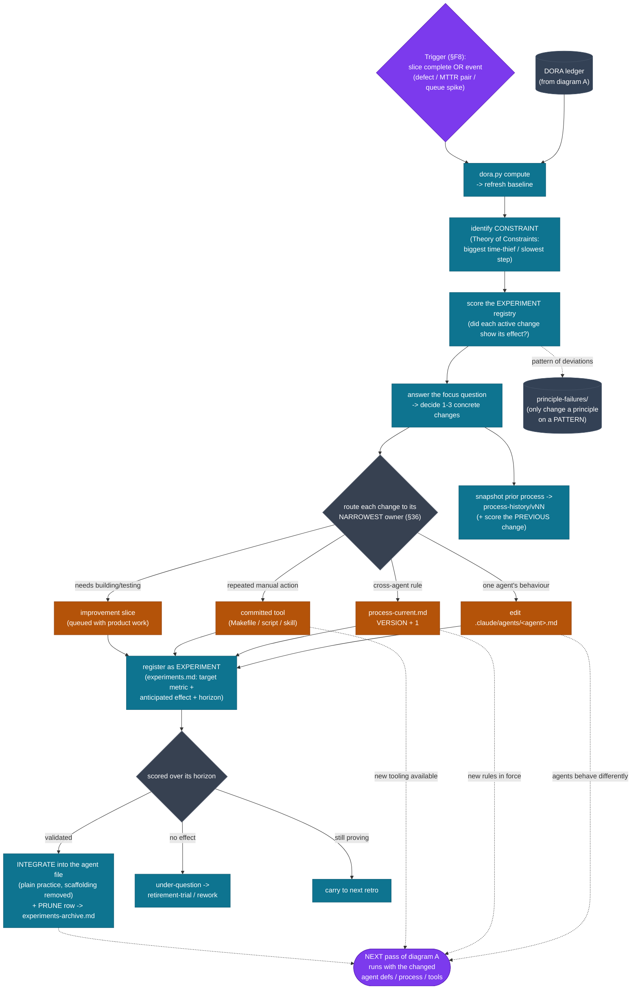

# How it all hangs together — the loops and the retro (v46)

Two diagrams: **(A)** the delivery loops (how work flows), **(B)** the
retro/self-improvement loop (what the retro changes and how it feeds back).

---

## A. The delivery loops

```mermaid
flowchart TD
    %% ---- gates (the only 2 human stops) ----
    HUMAN(["Human"]):::human
    G1{{"GATE 1: INTAKE\n(frame JTBD + value/cost)"}}:::gate
    G2{{"GATE 2: DEPLOY\n(only if infra-bearing)"}}:::gate

    HUMAN -->|"new requirement / defect"| G1

    %% ---- registry + queues ----
    G1 --> REG["flow-manager: register item\n(items.csv: REQ/CHK/SLC/UC)"]:::flow
    REG --> INTAKEQ[("Intake queue\nfloor/cap")]:::queue

    %% ---- replenishment: PROACTIVE, parallel, works AHEAD ----
    subgraph REPL["Replenishment loop  (product, runs in PARALLEL, ahead of need)"]
        direction TB
        DEC["product: decompose\nchunk -> use-cases"]:::prod
        DEC --> COST["value + cost + vc_ratio"]:::prod
    end
    INTAKEQ --> DEC
    COST --> READYQ

    READYQ[("Ready queue\nfloor=min_items / cap=wip_limit")]:::queue
    READYQ -.->|"depth < floor\n(or projected)"| DEC

    %% ---- pull the maximal independent set ----
    READYQ --> PULL["flow-manager: pull\nmaximal independent set (<= N)\nby vc_ratio + no shared seam"]:::flow

    %% ---- the inner dev loop, per use-case (parallel where independent) ----
    subgraph INNER["Inner dev loop  (per use-case; parallel by independence, §40 flags)"]
        direction TB
        CAP["cicd: capabilities?\n(only if needed)"]:::eng
        UID["ui-designer: structure?\n(if UI)"]:::eng
        ENG["engineer: TDD on trunk\nred -> green -> refactor"]:::eng
        UIV["ui-designer: validate?\n(if UI)"]:::eng
        CAP --> UID --> ENG --> UIV
    end
    PULL --> CAP

    UIV --> DEP["deploy (per-UC)"]:::flow
    DEP --> G2
    G2 --> TEST["tester: validate IN PROD\n(real surface, real data)"]:::test
    DEP -->|"app-only (no infra)\nauto-approve"| TEST

    %% ---- pass / fail ----
    TEST -->|"PASS"| DONE["mark UC done\nbubble UC->slice->chunk->req"]:::flow
    TEST -->|"FAIL"| REWORK[("Rework queue\nMTTR clock")]:::queue
    REWORK -->|"re-loop"| ENG

    %% ---- keep trucking / completion ----
    DONE --> CONT{"queue empty AND\nnothing replenishable?"}:::dec
    CONT -->|"NO — keep trucking\n(same turn, no stop)"| PULL
    CONT -->|"YES"| DONEREQ(["requirement complete\n-> ask human for more work"]):::human

    %% ---- defects pre-empt ----
    DEF["defect reported"]:::def
    DEF --> G1
    G1 -.->|"defect: JTBD-framed,\npre-empts to HEAD of Ready"| READYQ

    %% ---- every step emits ledger events (feeds diagram B) ----
    DONE -.->|"every step emits\nledger events"| LEDGER[("DORA ledger\n(history)")]:::data

    classDef gate fill:#7c3aed,color:#fff,stroke:#5b21b6;
    classDef queue fill:#1f2937,color:#fff,stroke:#4b5563;
    classDef flow fill:#0e7490,color:#fff,stroke:#155e75;
    classDef prod fill:#b45309,color:#fff,stroke:#92400e;
    classDef eng fill:#15803d,color:#fff,stroke:#166534;
    classDef test fill:#be123c,color:#fff,stroke:#9f1239;
    classDef human fill:#111827,color:#fff,stroke:#374151;
    classDef def fill:#dc2626,color:#fff,stroke:#991b1b;
    classDef dec fill:#374151,color:#fff,stroke:#6b7280;
    classDef data fill:#334155,color:#fff,stroke:#475569;
```

**The loops in A:**
1. **Pull dev loop** (the spine): Ready → pull independent set → inner dev loop
   (cicd?→ui?→engineer TDD→ui-validate?) → deploy → tester-in-prod → done →
   bubble → **back to pull**. It does NOT stop at slice/chunk/retro boundaries
   (v46) — only at the 2 gates or requirement-complete.
2. **Replenishment loop** (parallel, proactive): product decomposes the next
   slice/chunk **while the current one builds**, keeping Ready ≥ floor so the
   engineer always has the next item (EXP-034).
3. **Rework loop**: tester FAIL → Rework → re-loop the UC (MTTR clock).
4. **Defect loop**: a defect re-enters via intake, JTBD-framed, and **pre-empts
   to the head of Ready** (a defect on delivered value outranks queued work).

**The only 2 human stops:** GATE 1 (intake) and GATE 2 (deploy, *only* for
infra-bearing change). Everything else is autonomous.

---

## B. The retro / self-improvement loop — what it changes

This is the loop that makes the agents *improve over time*. It reads the ledger
that diagram A produces, decides one change, and **routes that change into the
artifacts the agents read** — so the next pass of diagram A runs differently.

**What the retro changes (the 4 routes) — this is the answer to "what parts the
retro are changing":**

| Route | Artifact changed | Example from observatory |
|---|---|---|
| one agent's behaviour | `.claude/agents/<agent>.md` | engineer.md gained "reconcile derived state vs registry" (EXP-035) |
| cross-agent rule | `process-current.md` **version+1** | v46 "ending the turn IS the stop" (EXP-031) |
| repeated manual action | committed **tool** | `dora.py record` instead of `cat >>` (EXP-032) |
| needs building | **improvement slice** | queued with product work |

Every change is logged as an **experiment** (`experiments.md`) with a target
metric; over its horizon it's **validated → integrated into the agent file +
pruned to the archive** (keeps the registry small), or **retired**. The
**feedback edge** (dotted, bottom) is the whole point: the changed agent defs /
process version / tools mean the **next run of diagram A behaves differently** —
that is the agents improving over time.

**Why the retro is itself kept TIGHT and never a "stop" (v46):** it runs
automatically at the §F8 trigger, in the same turn as the work, and the loop
continues straight out of it — a bloated retro, or ending the turn on it, would
add the very gross lead time it exists to reduce.
