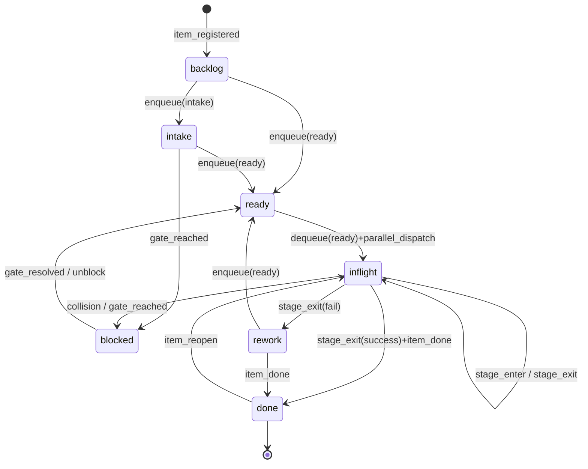
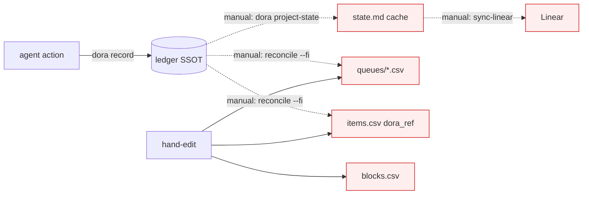
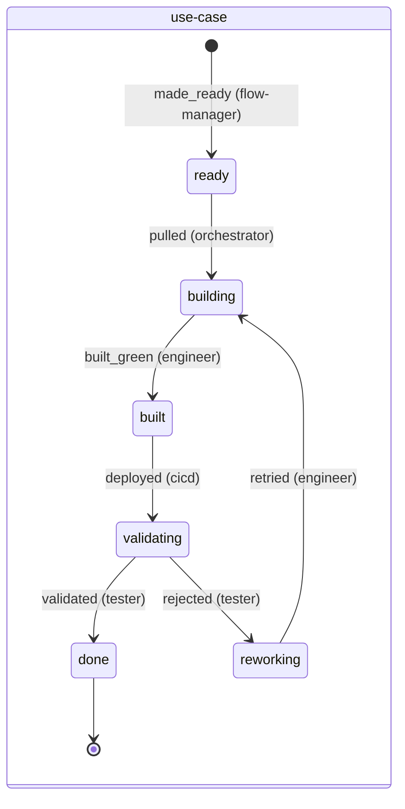

# Work-item state model — defect diagnosis and redesign

Status: **ACCEPTED — process v82, full cutover 2026-07-06.** Written to debug a
recurring drift defect and to evaluate whether the multi-queue model should be replaced
by a single self-contained-work-item model; adopted as the delivery substrate. This is
the **model of record** — the prior QueueApproach design (`archive/00`–`03`) is archived
history, preserved at git tag `QueueApproach`. Build contract: `process/machinery/CONTRACT.md`.

---

## 1. The defect, precisely

We keep hitting **state drift**: an item shows as open/ready in one place while it is
actually done in another. Twice this nearly re-ran destructive work (UC-O8 re-truncate;
UC-SF3 re-dispatch), and it produced the "35 items in Linear backlog" that were all
stale-done.

The root cause is **not** any one buggy script. It is structural: **the same fact —
"what state is item X in?" — is represented in up to six places, and no invariant forces
them to agree.**

| Store | Holds | Supposed role | Kept in sync by |
|---|---|---|---|
| `process/dora/ledger/<project>.csv` | append-only event log | **SSOT** (v52) | — (source) |
| `work/<p>/state.md` | current state + queue membership | derived cache | `dora project-state`, **run by hand** |
| `work/<p>/items/items.csv` | registry + `dora_ref` DONE marker | catalog | hand-edit + `reconcile-registry --fix` |
| `work/<p>/queues/*.csv` | queue membership | legacy snapshot | `reconcile-registry --fix` only |
| `work/<p>/items/blocks.csv` | block reasons | annotation | hand-edit |
| Linear board | mirror | human view | `sync-linear --live`, run by hand |

Every arrow between these is a place a write can land in one store and not the others.
The confirmed drift-entry points:

1. **`item_done` in the ledger, but `state.md` not regenerated.** `state.md` is a *cache
   produced by a command someone has to remember to run*. `sync-linear` and humans read
   the cache, so a done item still reads as Ready. (It is also *structurally incomplete*:
   pre-ledger items have no ledger events at all, so the projection defaulted 32 of them
   to Backlog — the "35 backlog" bug.)
2. **`dequeue` recorded late or not at all.** UC-SF3: the flow-manager went re-enqueue →
   dispatch without ever emitting `dequeue(ready)`. The ledger *itself* was missing the
   event, so the derived queue membership was wrong. Nothing enforces the invariant
   **"an item that is `done` is in no queue."**
3. **`items.csv` carries both `parent` and `children`.** The same edge (A→B) is written
   in A's `children` and B's `parent`. Two copies of one fact, free to disagree.

The deep statement: **our state-machine transitions are conventions written in agent
prose, not rules enforced by construction.** An agent can perform half a transition
(record `item_done`, forget `dequeue`) and nothing rejects it. And because the current
state is stored (in caches and CSVs) rather than *computed*, a half-transition leaves a
durable contradiction instead of being impossible.

### 1a. Current-state machine (as-is)



The transitions above are real and well-designed. The problem is the **layer underneath**:
this graph is documented in `.md` files, but the *state itself* lives in six stores that
each independently claim to know where an item is. The graph is advisory; the stores are
authoritative and mutually inconsistent.



---

## 2. Are separate queues a good idea at all?

**Queues as a *persisted* representation of state: no.** They are a second copy of a fact
("is X outstanding?") that the item's own history already answers. Persisting them is the
disease.

**Queues as a *derived view*: yes, and keep them.** "What is ready to pull?" is a genuine
and useful question. The fix is that the answer must be *computed on demand* from the
items, never stored and hand-reconciled.

Today we are stuck half-way: OagEventSource *claims* to derive queues from the ledger, but
still carries `queues/*.csv`, a hand-run `state.md` cache, and an `items.csv` DONE marker.
Six representations, five of them manually synced. That half-way state is worse than either
extreme.

---

## 3. Proposed model: the work item is the source of truth

One principle drives everything: **represent each fact exactly once, and compute every
other view from it.** Applied to work tracking, that means the *work item* holds its own
complete truth, and queues / boards / DORA / dependency graphs are all pure functions of
the set of items.

### 3a. Anatomy of a work item

Each item is one self-contained file (`work/<project>/items/<ID>.md` or `.json`) holding:

- **Identity & definition** — id, type, title, the JTBD/value statement, acceptance,
  scope. Frozen at registration (amendments are themselves events).
- **Type** — which *process* governs it (see 3b). Different item types have different
  lifecycles because they solve different problems.
- **Dependency edges** — its place in the graph (see 3d).
- **Event log** — an ordered, timestamped list of events, each naming the transition it
  performed and the agent that performed it. *This is the only place state lives.*

```
events:
  - { t: 2026-07-02T00:00:01Z, event: registered,  agent: flow-manager }
  - { t: 2026-07-02T00:00:05Z, event: made_ready,   agent: flow-manager, note: "vc=1.6" }
  - { t: 2026-07-02T00:12:00Z, event: pulled,       agent: orchestrator }
  - { t: 2026-07-02T00:24:00Z, event: built_green,  agent: engineer,  ref: <sha> }
  - { t: 2026-07-02T00:40:00Z, event: validated,    agent: tester,    ref: <sha> }
```

**Current state is not a field. It is `fold(events)` through the item's type state
machine.** You never *write* "state = done"; you append a `validated` event and the state
*becomes* done because that is where the graph lands. This makes the drift class
**unrepresentable**: there is no second store to disagree with, and a done item is in no
queue *by definition* because "in ready" is `state == ready`, computed from the same fold.

DORA falls out for free: every metric is a function over the event timestamps that are
already right there in the item.

### 3b. Per-type process graphs (the auditability piece)

Each **item type** owns a declared directed graph: states, the agent(s) that work each
state, the allowed transitions, and the **named event** that triggers each move.



A **defect** has a different graph (reproduce → fix → validate → gap-retro); a **chunk**
is an aggregate whose state *bubbles* from its children; a **slice** sits between. Forcing
all of these through one queue vocabulary is the current mismatch.

Two properties this buys us:

1. **Writes are edge-checked.** An agent may only append an event that is a legal
   transition from the item's current (folded) state. `built_green` when the item isn't
   `building` is rejected at write time — the half-transition that caused the drift
   becomes impossible.
2. **Wanting an undefined action is a governed event.** If an agent needs a move the graph
   doesn't allow, it cannot just do it — it **proposes an amendment to the graph, with a
   reason: a process experiment** (the existing `EXP-NNN` + retro + version-bump
   machinery). The process becomes a versioned, machine-checkable artifact instead of
   prose, and every change to it is auditable.

### 3c. Prioritisation as lenses, not stores

JTBD → chunk → slice → use-case → defect are **levels of abstraction, not separate state
stores.** They become lists of *pointers* to items (or the parent/child edges below).
"What's the backlog / what's ready / what's the flow" are **queries** over the item set,
recomputed on read. Nothing to reconcile because nothing is stored twice.

### 3d. Dependency edges live in the item — but store each edge once

Each item embeds its dependency edges so the graph can't drift from a separate
`use-case-deps.mmd`. **Caveat, and it matters:** storing both `parent` *and* `children`
(as `items.csv` does today) re-commits the original sin — one edge, two copies, free to
disagree.

Recommendation: **store each edge in one direction and derive the reverse.** Let each item
name its parents / the deps it needs (upward edges only); "children" and the full tree are
*computed* by scanning who names me. One direction cannot contradict itself. The loop's
"maximal independent set to pull" is then a pure function over these edges — no `.mmd`
file to keep in step.

### 3e. Completed items move to a done folder

A finished item's file (its whole truth — definition, full event history, DORA trail, edges)
moves from the active set to `work/<project>/items/done/`. Everything about it is in that
one file; archiving it archives the complete record. Queries that need history read the
folder; the hot path only scans active items.

### 3f. The decision log stays separate (per-project)

Per your steer: the **decision log remains a distinct project-level artifact.** The item
event-log answers *"what happened to this item, when"* (the mechanical/DORA trail); the
decision log is the cross-cutting narrative of *why* product/architecture choices were
made — it spans many items and outlives any one of them. Different question, different home.

---

## 4. Honest assessment — what this costs, and where it can go wrong

The redesign is sound and directly kills the drift class. It is not free:

1. **One canonical reducer, or you trade sync-drift for interpretation-drift.** "State =
   fold(events)" only removes drift if there is exactly *one* tested fold function + graph
   definition that everything calls. If each agent re-implements the fold, you get a new,
   subtler drift (two agents disagree on what the same log *means*). The win is real but it
   *relocates* the risk to a single, small, testable surface — it does not evaporate.
2. **Cross-item queries become O(N files).** "What's ready?", DORA aggregation, and the
   pull decision must load many item files instead of reading one ledger. For hundreds of
   items this is fine (it's what `dora.py` already does by scanning the ledger), but the
   pull cycle loads the whole dependency graph each pass. Acceptable; name it.
   - Upside: **per-item files are disjoint writes**, which *fixes* the multi-instance
     shared-git-index race that forced worktree isolation (EXP-097). Concurrency gets
     *better*, not worse.
3. **Graph amendments need governance.** If agents can freely rewrite the process graph,
   the process drifts. Route every amendment through the existing experiment/retro gate
   (propose → score → version-bump). Fits what we already have.
4. **Migration is itself risky.** Rewriting the work-tracking substrate mid-project is how
   you *create* drift — so we treated the cutover with the same care. In the event a **full
   cutover WAS done on OagEventSource** (2026-07-06): its items were migrated to per-item
   event-log files and `make wi-validate` proved the invariants held post-migration. The
   feared big-bang risk did not materialise because the migration was itself validated by
   construction, and the QueueApproach stores were retained read-only (git tag
   `QueueApproach`) rather than deleted. The model is now the default for every project.
5. **We already know this pattern cold.** The agents build event-sourced systems
   (OagEventSource *is* one: immutable log, fold-to-state, projections). Making the process
   itself event-sourced is the same shape — a point in favour of getting it right.

---

## 5. Recommendation

Adopted, as a scored process experiment. What was done (all complete at v82 cutover):

1. **Wrote the type graphs** (use-case, defect, chunk, slice, JTBD/requirement) as
   declarative data: states, per-state agents, transitions, event names —
   `process/machinery/state-graphs.json`. This is the auditable core.
2. **Built one reducer** — `fold(item.events, type_graph) -> state` — with edge-checking on
   append (reject illegal transitions; an illegal transition surfaces an
   amendment-proposal). Tested once, called everywhere via `make wi-append`.
3. **Made every other view a pure projection** of the item set: queues, board status,
   DORA, dependency tree, regenerated by `make wi-project` into `views/`. `state.md`,
   `queues/*.csv` and the `items.csv` state columns were removed as *stored* state and
   now exist only as read-only derived views.
4. **Stored edges one-directional; derived the reverse** (`parents`/`deps` up; `children`
   and the subtree computed).
5. **Cut over on OagEventSource itself** (not deferred to a later project — see §4.4).
   Scored against baseline: drift incidents (0 post-cutover), reconcile token-cost per
   resume (↓), pull-cycle latency (no regression).

The single invariant that must hold forever after: **no view is ever persisted-and-hand-
synced. Every view is recomputed from the items on read.** The moment we cache a view and
edit it by hand, we have reinvented `state.md` and the drift is back.
