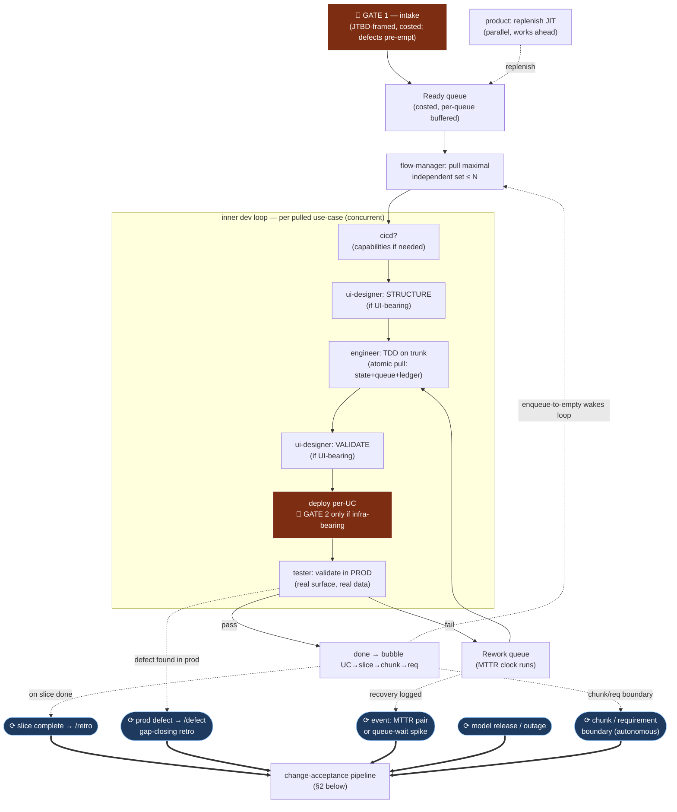
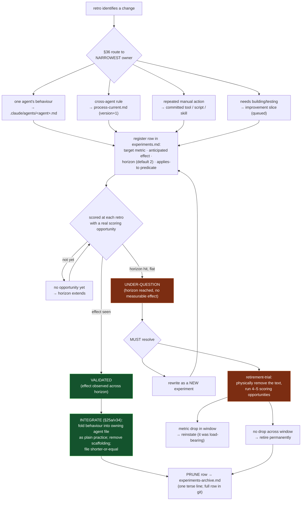

# Process map — delivery loop, retro points, and change acceptance

Durable reference for **how the agent system operates**: where work flows, where
retrospectives fire, and the lifecycle a retro-proposed change follows before it
becomes permanent. This documents the persistent `/process` self-state (v40+
pull-based flow, STAGE F) — not any one project. Authoritative text lives in
`process-current.md`; this file is the navigable picture of it.

> Scope note: this is agent-process documentation, so it lives in `/process`,
> not in a project's `work/<project>/docs/` (that space is resettable project
> output). Keep it here.

---

## 1. The delivery loop, with retro trigger points

The inner dev loop is **pull-based** (v40): a continuous loop pulls the maximal
independent set of ready use-cases, builds each TDD-on-trunk, deploys per-UC, and
validates in prod. Product replenishes the Ready buffer in parallel. Only **two
human gates** remain — intake and infra-bearing deploy. Retrospectives fire at
the points marked ⟳.

**When retros fire (the ⟳ points), in practice:**

| Trigger | Cadence | Scope of the retro |
|---|---|---|
| **Slice completion** | Every delivered slice (§F8) | Full: recompute DORA, score the registry, route changes. |
| **Prod defect** (`/defect`) | Every confirmed defect | Focused gap-closing: "what let this through?" → one experiment. |
| **Event** — MTTR pair, queue-wait spike | As the event occurs | Targeted at the surfaced constraint. |
| **Model release / availability incident** | On the event | Re-assess model tiering (§7a); re-tier on outage. |
| **Chunk / requirement boundary** | Autonomous (no human stop) except requirement-complete | Boundary is not a stop-and-ask (EXP-031); requirement-complete IS a human gate (§F3d). |
| **Human-invoked** `/retro` | On demand | Whatever focus question is passed. |

The retro is owned by the **orchestrator**, which gathers each agent's
what-worked/what-hurt but makes the process call. It always: (1) recomputes the
DORA baseline and names the Theory-of-Constraints constraint, (2) scores the
experiment registry, (3) routes each change to its narrowest owner, (4) snapshots
the prior process version to `process-history/`.

---

## 2. Change acceptance — the experiment lifecycle

**Every** retro-proposed change is a registered experiment, not a silent edit.
This is the mechanism that lets the system tell improvement from churn: a change
must name a DORA metric it targets and an anticipated effect, then earn its place
by being scored over a horizon. Nothing becomes permanent until it has
demonstrated value.

**Key invariants of acceptance:**

- **A change must target a named DORA metric** (throughput/lead-time, CFR,
  deployment frequency, MTTR) and state its anticipated effect, so the next retro
  can score it against reality — not against intention.
- **Agent-def simplicity is a goal.** Text that cannot demonstrate value does not
  stay. Validated behaviour is *folded in* (file shorter-or-equal), not appended;
  unproven text faces a retirement-trial.
- **The registry holds only live experiments.** Terminal rows (integrated /
  retired / reworked) are pruned to `experiments-archive.md` — the index of what
  has been learned and folded in. This keeps the registry from accreting (v45).
- **EXP-011 scores the integration+pruning policy itself** — the next retro
  spot-checks that an integrated mechanism still fires.

---

## 3. How to read the two diagrams together

The delivery loop (§1) is where **evidence is generated** — every slice,
deploy, defect, and recovery writes a DORA ledger row. The acceptance lifecycle
(§2) is where **that evidence decides what the agents become** — a change earns
permanence only by moving a metric over its horizon. The retro is the hinge: it
reads the loop's evidence and drives the lifecycle.

For an honest assessment of whether this machinery is actually improving
delivery performance — and the measurement caveats that complicate that
question — see `process/retro-effectiveness-2026-06-17.md`.
