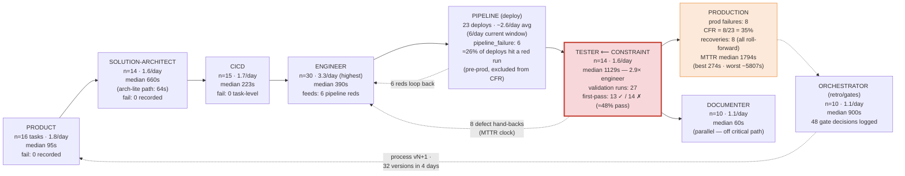

# Current process — as actually in place (extracted from agent defs + process v32)

Sources walked: `.claude/agents/{orchestrator,product,solution-architect,cicd,engineer,tester,documenter}.md`,
`process/process-current.md` (v32), the slash commands, and `process/dora/ledger.csv`
(9 active days, 2026-06-04 → 2026-06-07).

---

## Diagram 1 — The process graph

Node format: **Activity** / *intended outcome* / `✓ how success is known`.
Dashed edges are **backward flows** (rework, defects, learning loops).

```mermaid
flowchart TD

%% ============ STAGE 0/1: REQUIREMENT & SELECTION ============
subgraph SEL["STAGE 0-1 · Requirement & next-work selection"]
  NW["ORCHESTRATOR: next-work selection (§38/§10)
  — choose over open-items.md + improvement-slices
  → the highest-DORA-return item runs next
  ✓ decision-log row states candidates + why winner won"]
  PV["PRODUCT: JTBD vision (/requirement-new)
  — express jobs: when/wants/so-that, no solutioning
  → project.md vision + chunks
  ✓ GATE 1: human accepts vision"]
  ARC["SOLUTION-ARCHITECT: target architecture
  — minimum whole-solution view, AWS Well-Architected
  → architecture/current.md (C4 mermaid)
  ✓ GATE: human accepts architecture"]
end

%% ============ STAGE 2: SLICE PLANNING ============
subgraph PLAN["STAGE 2 · Slice planning"]
  SL["PRODUCT: next smallest slice (/slice-next)
  — Killick test: user can do something new
  → slice.md (job, scope, NOT-scope, success measures)
  ✓ GATE 2: human accepts slice"]
  UC["PRODUCT: use-case decomposition (§37/§11)
  — buildable/testable units + TRUE dependency edges only
  → use-cases.md + use-case-deps.mmd (§12a)
  ✓ edges = parallelism plan orchestrator can read"]
  AD["SOLUTION-ARCHITECT: delta + security review (§12)
  — minimum arch change; platform gates as explicit nodes
  → deltas/nnn.md + data-flow.mmd + security notes
  ✓ GATE 3: human accepts / auto-accept if
  'no new surface/flow/boundary' stated (§9a)"]
  ACC["PRODUCT + ARCHITECT: acceptance cases
  — F-cases (customer) + T-cases (observable) + S-cases (policy)
  → acceptance.md, every case tagged to a UC
  ✓ each case is checkable; S-cases become policy tests"]
end

%% ============ STAGE 3: BUILD ============
subgraph BUILD["STAGE 3 · Build (trunk, TDD)"]
  CAP["CICD: capabilities before engineering
  — envs/pipeline/flags/allowlist ONLY as need demands
  → pipelines green, prereqs BEFORE first push (§19)
  ✓ capabilities.md current; fail-fast config step;
  zero permission prompts (committed allowlist)"]
  RT["ENGINEER: thin route
  — ordered failing tests advancing solution most per step
  → route.md grouped by use case
  ✓ read-before-build against dependency model (§12a)"]
  ENG["ENGINEER(s): TDD build, parallel by UC
  — red→green→refactor; UC flags isolate WIP (§40)
  → commits to trunk, each green+lint-clean (§14)
  ✓ UC done when its own acceptance cases pass;
  synth contract tests pin cross-stack edges (§17);
  .mmd updated in same commit (§12a)"]
  G4{"GATE 4: go/no-go to deploy
  ✓ auto if app-only diff + tests+lint+build green;
  human if infra-bearing (§9a)"}
end

%% ============ STAGE 4/5: DEPLOY & VALIDATE ============
subgraph SHIP["STAGE 4-5 · Deploy & validate in PROD"]
  CD["PIPELINE: continuous deploy (push = deploy)
  — two pipelines: app (S3/CDN) + infra (CDK)
  → change live in production
  ✓ run green AND served-sha == deployed-sha
  (principle 01, identity before behaviour)"]
  WSP["ENGINEER: walking-skeleton probe (§17)
  — one real request through each NEW platform mechanism
  → wiring proven before suites built on top
  ✓ probe asserts allow+deny paths (e.g. make ws-skeleton 4/4)"]
  VAL["TESTER: in-prod validation
  — exercise the MOST PUBLIC surface (real browser for web)
  → test plan from dependency-model diff (§12a), tick-off list;
  validation-as-code only (committed specs, no ad-hoc checks)
  ✓ success measures + acceptance evidenced; result.md written;
  ≥1 browser-transport spec; identity asserted first"]
  DEL(["DELIVERED
  ✓ decision-log 'delivered' row + deploy ledger row"])
end

%% ============ STAGE 6/7: DOCUMENT & LEARN ============
subgraph LEARN["STAGE 6-7 · Document & retro"]
  DOC["DOCUMENTER (parallel, non-blocking §21)
  — docs/usage.md + docs/runbook.md from what SHIPPED
  ✓ every claim traceable to result.md/acceptance.md;
  runbook's first diagnostic = build identity"]
  RET["ORCHESTRATOR: retro (automatic at delivery §20/§26)
  — recompute DORA, find constraint (ToC), score experiments
  → process vN+1 + experiments.md statuses + routed changes
  ✓ every change has target metric + anticipated effect;
  no-effect changes → under-question → retirement-trial (§25a)"]
  EXP["EXPERIMENT REGISTRY (§25a)
  — every routed change is an experiment with a horizon
  ✓ validated / retired by observed DORA movement
  (null-hypothesis: remove text, watch the metric)"]
end

%% ============ FORWARD FLOW ============
NW --> PV
PV -->|gate 1 ✓| ARC
ARC --> SL
NW -->|existing project| SL
SL -->|gate 2 ✓| UC
UC --> AD
AD -->|gate 3 ✓| ACC
ACC --> CAP
CAP --> RT
RT --> ENG
ENG --> G4
G4 -->|go| CD
CD --> WSP
WSP -->|wiring proven| VAL
VAL -->|pass| DEL
DEL --> DOC
DEL --> RET
RET --> EXP

%% ============ BACKWARD FLOWS (the loops) ============
VAL -.->|"FAIL: defect brief → engineer
(defect-as-spec, MTTR clock runs)"| ENG
WSP -.->|"probe fails → fix wiring
(DEFECT-H2-002 path)"| ENG
CD -.->|"pipeline red (pipeline_failure)
fix-push-wait loop"| ENG
CD -.->|"platform constraint discovered at deploy
→ re-scope slice (GATE-AMEND)"| AD
ENG -.->|"hidden dependency edge found
→ re-serialise schedule (§39)"| RT
VAL -.->|"capability gap flagged
(allowlist, probe tooling)"| CAP
RET -.->|"agent-def edits, process rules,
tools, improvement slices (§25)"| NW
EXP -.->|"retirement-trial removes text;
metric drop ⇒ reinstate"| RET
DOC -.->|"rough edges → known limitations
→ open-items"| NW
VAL -.->|"residue harvested
→ open-items register (§38)"| NW
DEL -.->|"N+1 slice planned in parallel
during validation (§9b)"| SL

%% styling
classDef gate fill:#fff3cd,stroke:#b8860b
classDef back stroke-dasharray: 5 5
class G4 gate
```

**Every node is bracketed by DORA ledger rows** (`task_start`/`task_end`/`deploy`/
`failure`/`recovery`/`gate`) — that instrumentation is what makes Diagram 2 possible,
and the orchestrator's constraint-finding (Theory of Constraints) runs on it each retro.

---

## Diagram 2 — Throughput, lead time, failure rate (measured, ledger.csv)

Window: 9 active days, 9 slices delivered, 23 deploys.
Whole-pipeline: **gross lead (median) 3618s/slice · 6 deploys/active-day (current window) ·
CFR 35% · MTTR (median) 1794s**.

### Reading the numbers

| Stage | Throughput | Lead (median) | Failure rate | Note |
|---|---|---|---|---|
| product | 1.8 tasks/day | 95 s | ~0 | never the constraint |
| solution-architect | 1.6/day | 660 s | ~0 | arch-lite path cut it to 64 s when applicable |
| cicd | 1.7/day | 223 s | ~0 task-level | its failures surface downstream as pipeline reds |
| engineer | **3.3/day** | 390 s | 6 pipeline reds originate here | highest throughput; quality of its output drives the two stages below |
| pipeline | 23 deploys | 2–8 min/run | ~26% red-run rate | pre-prod; excluded from CFR by §3 convention |
| **tester** | 1.6/day | **1129 s** | ~52% first-pass validation fail | **the constraint** — 2.9× engineer median; cost dominated by discovery + defect re-validation rounds |
| production | — | — | **CFR 35%**, MTTR 1794 s | 8 prod failures, 8 recoveries, 100% roll-forward |
| documenter | 1.1/day | 60 s | — | parallel, off the critical path by design |
| orchestrator | 1.1/day | 900 s | — | gates + retros; 48 logged gate decisions |

**Where the flow loops back hardest:** tester→engineer (8 defect hand-backs) and
pipeline→engineer (6 reds). Both loops land on the engineer, which is why the current
process attacks them upstream of the tester: walking-skeleton probes, synth contract
tests, browser-first build tests (principles/02), and the v31 change-impact model —
all aimed at shrinking the constraint's queue rather than speeding the constraint up.
