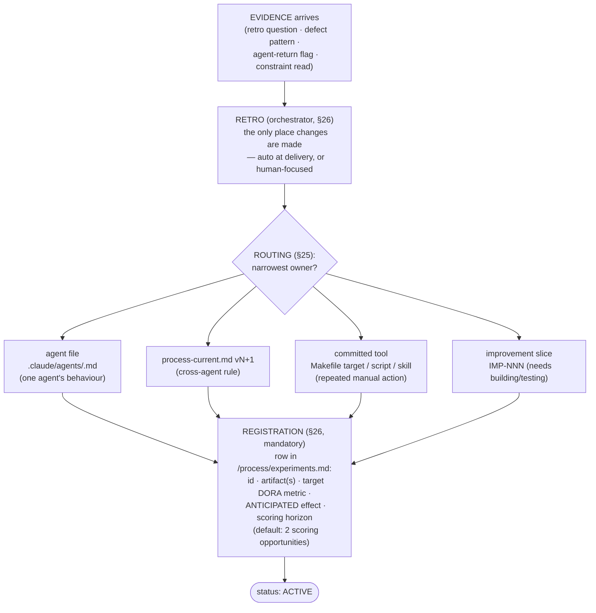
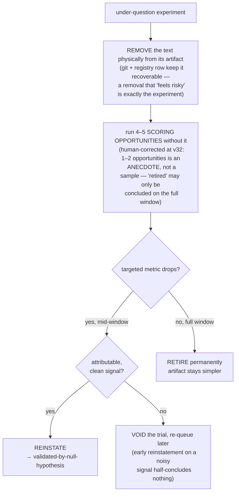

# The experiment process — how changes are proposed, accepted, and rejected

(Source of truth: `process/process-current.md` §25a + §26, `/process/experiments.md`,
`.claude/commands/retro.md` steps 5a/7. This file is a description, not the rules.)

Every change routed into the system — an agent-file edit, a process section, a
committed tool, a skill note — is an **experiment**, never a permanent
acquisition. Text earns its place by measurably improving a DORA metric; text
that cannot demonstrate value is removed. The goal is agents that are as
**simple and effective** as possible.

---

## 1. Where experiment suggestions come from

Suggestions are not free-form ideas; each must arrive carrying **evidence**:

| Source | Example |
|---|---|
| Retro focus question (human-directed) | "tester and engineer should share dependency trees" → EXP-005 |
| Defect root-cause pattern (≥2 data points — never a single one) | platform-semantic defects → data-flow platform-gate nodes |
| Agent return flags (friction, gaps, observations) | suite self-interference with rate limits → EXP-009 |
| Principle-failure entries showing a repeat | stash-over-live-agents ×2 → IMP-005 case strengthens |
| Constraint analysis (Theory of Constraints on the DORA baseline) | tester median 1130s → §11a per-UC probes |

A **single data point never changes a principle** (§26). It can, however, seed
an experiment — the experiment is exactly the device that turns one observation
into measured evidence.

---

## 2. The suggestion → registration pipeline (stages)



Key gate at registration: a change **without a named target metric and a
falsifiable anticipated effect cannot be routed at all**. "Agents try harder"
is not an anticipated effect; "tester median < 900s" is.

---

## 3. The experiment lifecycle (states)

```mermaid
stateDiagram-v2
  [*] --> active : routed + registered\n(metric, effect, horizon)

  active --> validated : anticipated effect OBSERVED\nat a retro scoring pass
  active --> active : no scoring opportunity yet\n(horizon EXTENDS — does not count against)
  active --> under_question : horizon reached,\nNO measurable improvement

  under_question --> active : REWRITE — sharper mechanism,\nnew experiment id, new horizon
  under_question --> retirement_trial : start null-hypothesis test\n(text PHYSICALLY REMOVED from artifact)

  retirement_trial --> reinstated : targeted metric DROPS attributably\n(early exit allowed — safety valve)
  retirement_trial --> retired : NO drop across the FULL\n4–5 scoring opportunities
  retirement_trial --> active : noisy early signal\n→ trial VOIDED, re-queued later

  reinstated --> validated : marked validated-by-null-hypothesis\n(strongest evidence class)
  validated --> integrated : agent file REWRITTEN (v34)\nbehaviour becomes core practice;\nscaffolding removed; shorter or equal
  integrated --> [*] : mechanism spot-checked next retro;\nre-opened only if it stops firing\nor its metric regresses
  retired --> [*] : text gone permanently;\nregistry row records the evidence
```

### State definitions

| State | Meaning | Exit condition |
|---|---|---|
| **active** | In force; being scored at every retro that offers an opportunity | scored MET → validated; horizon spent without effect → under-question |
| **validated** | Anticipated effect observed. ACCEPTED — and immediately due for integration | triggers the integration rewrite (v34) |
| **integrated** | The owning agent file(s) have been REWRITTEN: the behaviour is woven into the agent's core working instructions as plain operating practice — no "process vNN" citations, no EXP references, no trial caveats. The rewrite is a simplification pass: the file ends **shorter or equal**, never longer, and the mechanism must survive intact. Provenance lives in the registry row + git, not in the agent's prompt | mechanism spot-check at the next retro; re-opened only if the behaviour stops firing or its metric regresses |
| **under-question** | Horizon reached, no measurable improvement. MUST be resolved at that retro — it cannot linger | rewrite OR retirement-trial |
| **retirement-trial** | The null-hypothesis test (see §4) | reinstate / retire / void |
| **validated-by-null-hypothesis** | Removal caused a metric drop — the strongest possible proof of value | permanent |
| **retired** | Removal caused nothing — the text was ornament | permanent (git + registry keep it recoverable) |

---

## 4. The null-hypothesis (retirement-trial) mechanics

This is how the process REJECTS changes that survived on plausibility alone:



### Guard rails

1. **Sample size:** 4–5 scoring opportunities per trial. One or two is an
   anecdote. (Human correction applied at v32 — the original ≥2 was wrong.)
2. **Concurrency guard (NOT a sample-size statement):** at most ONE trial
   *running* per agent artifact at a time — two simultaneous removals from the
   same artifact destroy attribution.
3. **Blast-radius rule:** never trial a rule whose failure mode is a prod
   outage class still open elsewhere. Null-hypothesis tests run where the
   blast radius is a *metric*, not a *user*.
4. **Confounded windows:** when several changes landed on the same metric in
   the same slice, an experiment is scored against its own **mechanism** — did
   the behaviour it prescribes actually occur and visibly help? — not just the
   aggregate number. (Example: EXP-005 scored 1/2 MET because the
   read-before-build stop *demonstrably* prevented a prod AccessDenied,
   independent of what CFR did that day.)

---

## 5. Acceptance and rejection — what they look like in practice

**Accepted (validated):**
- *EXP-006 (use-case flags, §40):* H2_ENFORCE ran the full two-phase lifecycle
  on a real seam and prevented enforcement-before-credentials breakage by
  design; factor-out ended with an empty template diff. → stays, permanently.
- *EXP-001 (real-browser-not-node):* the browser spec was the only surface
  that exposed DEFECT-H2-003's user symptom. → stays.

**Rejected/reworked paths:**
- *EXP-003 (v29 §19 corollary):* text existed; DEFECT-H2-001 happened anyway —
  the mechanism (reading the rule at route time) didn't fire. Scored PARTIAL →
  **reworked** into EXP-005's read-before-build, which makes the reading
  structural instead of hopeful. This is the "rewrite" exit from
  under-question.
- No retirement-trial has run yet (the registry is one day old); the first
  candidates will be whatever reaches under-question with its horizon spent.

**Grandfather rule (scope control):** agent-def content routed before the
registry existed is NOT bulk-imported — that would be ceremony without
evidence. When a pre-existing section visibly drives (or visibly fails to
drive) an outcome at a retro, it is added *then*, with that evidence as its
first scoring row. The inventory grows by observation, not by audit.

---

## 6. Who does what, when

| Actor | Responsibility |
|---|---|
| **Orchestrator (at every retro)** | Scores every active row with an opportunity (retro step 5a); forces resolution of under-question rows; registers every newly-routed change (step 7); runs/concludes retirement-trials |
| **Any agent (in returns)** | Supplies the raw evidence: flags, frictions, observations — nothing flagged may silently evaporate |
| **Human** | Directs focused retros; corrects the process itself (e.g. the 4–5 sample-size rule); owns calls that are genuinely theirs |
| **The registry (`/process/experiments.md`)** | The single scoring view over everything routed. The §22 change-set queue stays separate — it lists obligations queued for NEXT work; the registry tracks what already shipped |

## 7. Integration — what happens after acceptance (v34)

Validation is not the end state. A validated experiment still sits in the agent
file as a bolted-on dated section ("## X (process v31 §12a)…") — scaffolding
that made it auditable while under test, but is noise once proven. At the next
retro after validation, the orchestrator **rewrites the owning agent file(s)**:

- the behaviour moves into the agent's core sections ("How you work", the
  relevant craft heading), phrased as plain operating practice;
- version citations, EXP ids, and trial caveats are deleted — provenance lives
  in the registry row and git history, not in the prompt the agent reads;
- the file must end **shorter or equal** — integration is a simplification
  pass, never an expansion;
- the next retro spot-checks that the mechanism still fires post-rewrite.

Integration is itself the experiment **EXP-011** (horizon: 3 integrations):
if integrated agents do not perform at least as well — per-agent median task
time, mechanism compliance, def line/section count — the integration policy is
questioned, rewritten, or retired exactly like any other change. First
candidates: EXP-001/004/006/007, all validated but still carried as dated
sections in the engineer/tester/cicd defs.

---

The meta-experiment **EXP-008** watches the watcher: the experiment process is
itself registered, scored on whether the registry is actually maintained, at
least one under-question item is resolved within 3 retros, and agent-def line
count stops growing monotonically. If the experiment process can't demonstrate
its own value, it goes the same way as anything else.
