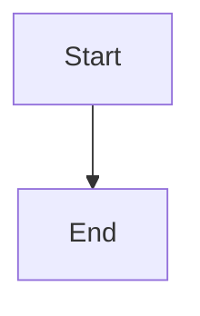

# s004 Value-stream map (demo fixture slice)

This is a deterministic fixture slice.md used by the UC-S005-3 detail-pane
browser spec. Clicking the UC-S004-1 node in the demo tree resolves the slug
`s004-value-stream-map` and fetches THIS file's raw text into the detail pane.

## Marker
UNIQUE-FIXTURE-MARKER-S004 — the browser spec asserts this string is visible in
the rendered artifact view, proving the full path (tree click → slug derivation
→ /slices/:slug/:artifact fetch → markdown render) works end-to-end in a real browser.

## Success measures (markdown table — UC-S005-4 AC-S005-4-1)

| measure | target |
| --- | --- |
| render | table not pipes |
| code | fenced block |

A fenced code block (UC-S005-4 AC-S005-4-2):

```js
const x = 1;
```

A fenced mermaid diagram (UC-S005-4 AC-S005-3-3 / A11Y-S005-10):


