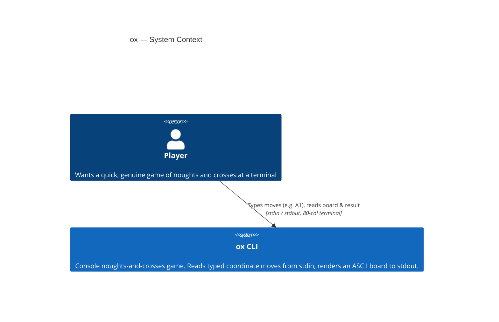
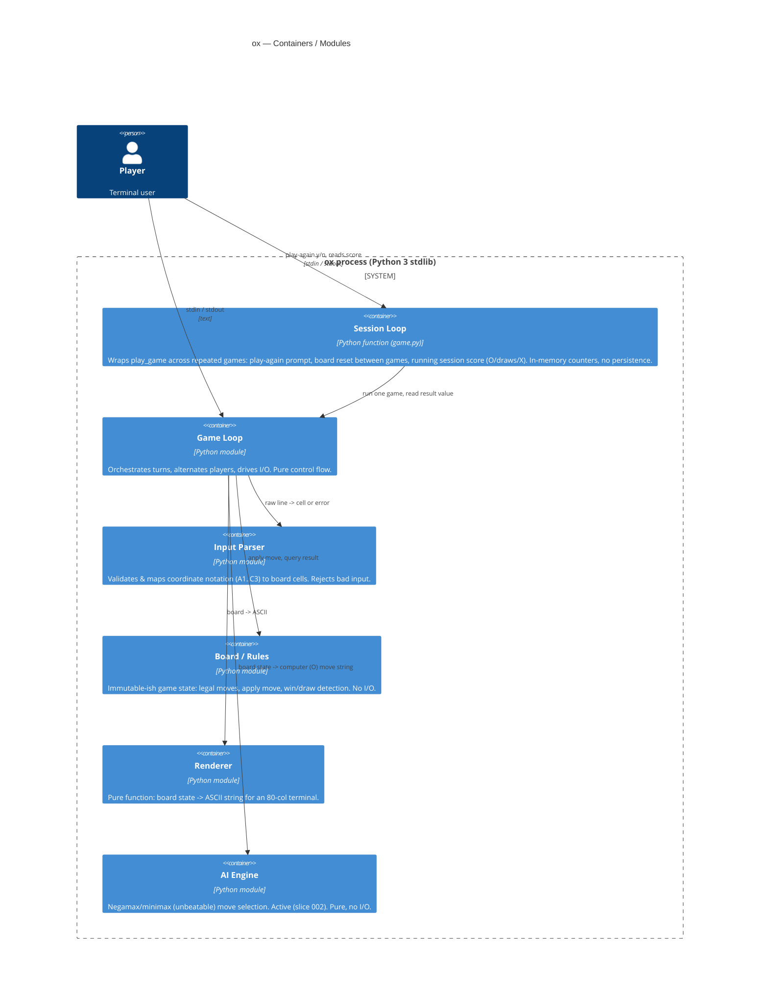

# Solution architecture — current (C4)

> **Deviation from default:** the project standard is AWS Well-Architected with
> account & network structure. `ox` is a **single-user, local console tool** —
> no cloud, no network, no persistence, no IAM. Those sections are intentionally
> N/A and recorded in `/process/principle-failures/`. The applicable
> Well-Architected pillars (Security, Reliability, Operational Excellence) are
> applied at process scope, not infrastructure scope.

## Language / runtime decision

- **Python 3 (>= 3.10), standard library only.** No third-party runtime
  dependencies.
- Rationale: zero-install on most developer/CI machines, portable across macOS /
  Linux / Windows terminals, strong stdlib for I/O and a clean way to express a
  minimax engine. A single-file or small-package program needs no build step,
  which keeps lead time and the rollback story trivial (revert the source).
- `match`/structural features and type hints assume 3.10+; CI pins the floor.

## C1 — System context



No external systems, no datastore, no network. The only boundaries are the
terminal's stdin/stdout and the OS process.

## C2 — Containers



### Module responsibilities & boundaries

| Module | Pure? | Responsibility | Does NOT |
|--------|-------|----------------|----------|
| Session Loop | No (I/O) | Repeat games, play-again prompt, reset board between games, tally session score (O/draws/X), print score line | Know rules, rendering, or turn sequencing |
| Game Loop | No (I/O) | Turn sequencing, prompt, read line, dispatch, print | Know rules, rendering detail, or session/replay |
| Input Parser | Yes | `"A1"`/`"a1"` -> `(row, col)`; reject malformed/occupied | Touch stdin or board state |
| Board / Rules | Yes | Hold marks, list legal cells, apply, detect win/draw | Print or read |
| Renderer | Yes | State -> aligned ASCII grid string | Mutate state |
| AI Engine | Yes | Optimal (never-losing) move via negamax | Print, read, or mutate the live board |

The I/O boundary is confined to the Game Loop. Everything else is a pure
function of inputs, which makes the rules, renderer, parser and AI unit-testable
without a terminal.

### AI Engine (slice 002 — active)

- Interface: `ai_move(board_state) -> str`. Pure function of board state;
  returns a coordinate string in the Parser's `A1..C3` grammar. It derives the
  side to move from the state (X starts), so it needs no extra argument and is
  used directly as a `players` move-supplier.
- Plug-in: `play_game(players={"O": ai_move})`; X stays on stdin, O is the AI.
  `python3 -m ox` defaults O to the AI. The AI's move re-enters through the same
  Parser -> Board.apply path as a human move — the AI has no privileged write
  path into the Board.
- Algorithm: negamax over the full game tree (depth <= 9; ~3.6e5 orderings —
  fully enumerable, alpha-beta optional). Deterministic tie-break for test
  stability.
- **Guarantee: the AI never loses.** For every sequence of legal human moves the
  game ends in a draw or an O win; no human-win path exists (success measure 1).
  Verified exhaustively over the game tree, not by sampling.

### Session Loop (slice 003 — active)

- Interface: `run_session(players=None, out=None, again=None) -> dict`, in
  `game.py`. Wraps `play_game()` and is what `main()` / `python -m ox` runs.
- Score: an in-memory `{"O": int, "draws": int, "X": int}` dict, created per
  session, **no persistence** — counts vanish on process exit. Incremented from
  `play_game()`'s public return value only.
- Replay: on "y"/"Y" it loops and calls `play_game()` again, which builds a fresh
  board (`new_board()`) — reset is automatic, no shared mutable state. Any other
  answer exits 0. Invalid input re-prompts exactly once (no infinite loop).
- `again` is an injectable play-again supplier (`prompt -> str`, defaults to
  stdin), mirroring the move-supplier seam, so multi-game sessions are testable
  without a subprocess.

## C3 — Components

Not warranted at this scale. The C2 module split is the working unit of design.

## Data flow (one turn)

1. Loop renders current board (Renderer) and prompts the active player.
2. Loop reads one line from stdin.
3. Parser validates the line -> cell coordinate, or an error reason.
4. On error: Loop reprints the reason and re-prompts the **same** player (no turn
   lost). On success: Loop asks Board to apply the move.
5. Board returns new state + result status (in-progress / win / draw).
6. Loop renders the new board; if terminal, prints the unambiguous result.

State lives only in memory for the lifetime of the process. Nothing is written
to disk or sent over any socket.

## Accounts & network

N/A — local process only. No AWS/Azure account, no VPC, no inbound/outbound
network, no ports opened.

## Well-Architected notes (applicable subset)

- **Security:** untrusted input is the stdin coordinate string plus the single
  play-again character (slice 003). Both are validated, length-bounded, and never
  used to construct a shell command, path, format string, or `eval`. The AI
  Engine adds no input surface (pure function of in-process state). See
  `architecture/security/cli-process.md` and `architecture/security/ai-engine.md`.
- **Reliability:** game is deterministic; invalid input cannot crash the loop or
  forfeit a turn (success measure 3). The AI (slice 002) is provably non-losing,
  verified exhaustively over the game tree.
- **Operational Excellence:** zero-dependency, runnable with one command; rollback
  is a source revert.
- **Performance / Cost:** trivial; a full game completes well under the 30s budget
  (success measure 5). N/A for cost.
```
