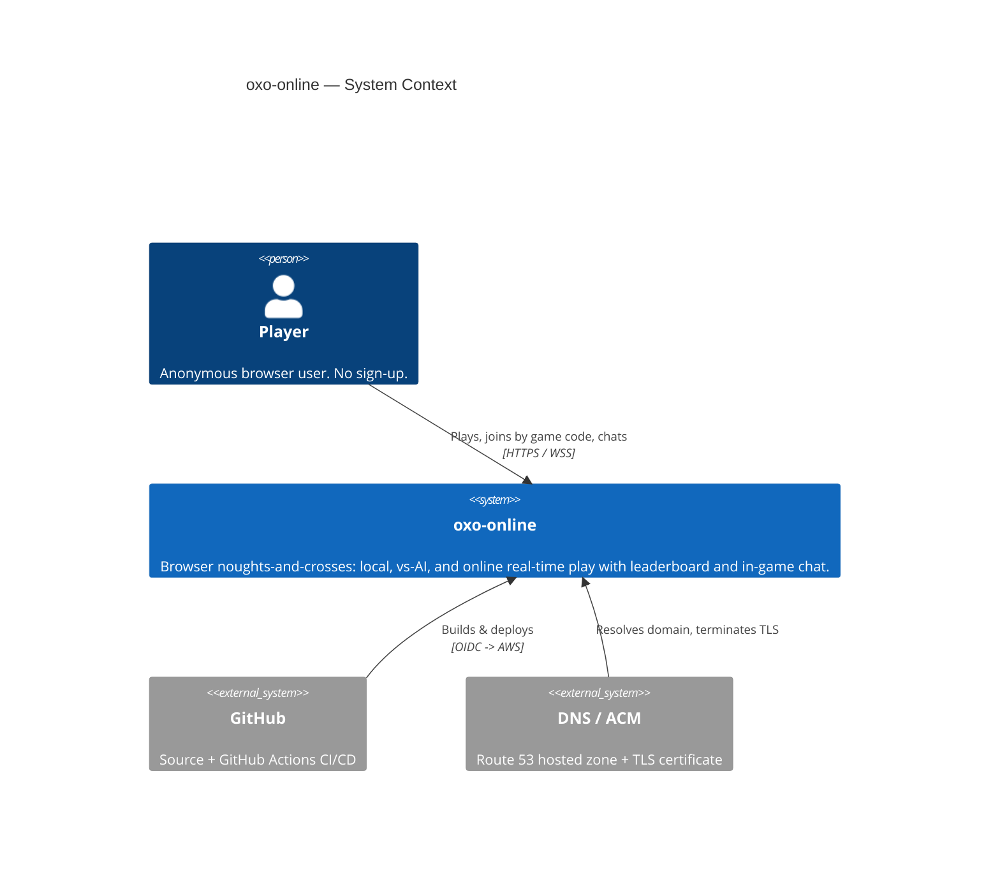
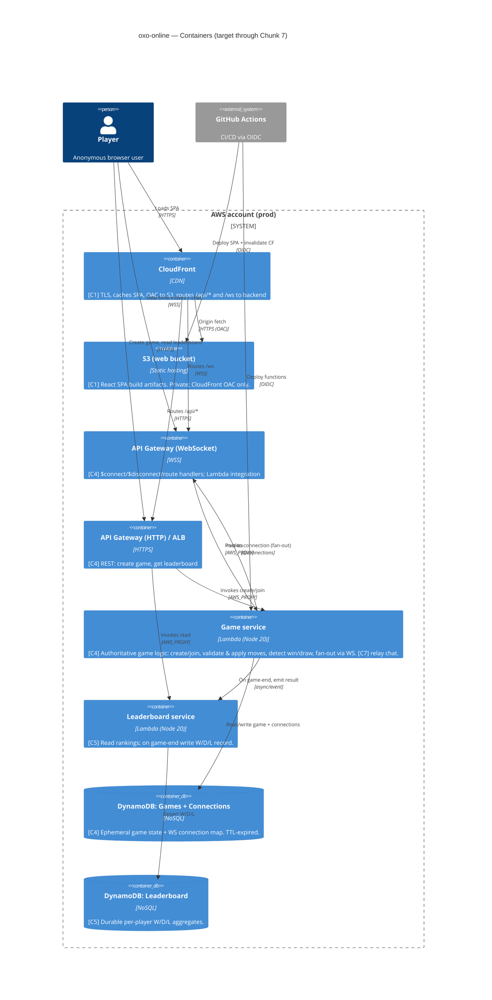

# Solution architecture — current (C4)

Follows AWS Well-Architected by default (Azure by exception — none taken here).
This is a **cloud/hosted** project. Diagrams are Mermaid C4. Only what is decided
is recorded; later chunks revise this when value is re-sliced.

> Architecture produced before `aws-architecture` skill existed; skill has since
> been created and the decisions here are consistent with it. See §11 reversal
> log in the skill for the oxo-online-specific deviations.

---

## Chunk-readiness legend

| Tag | Meaning | Status |
|-----|---------|--------|
| **[C1]** | Needed for Chunk 1 (deployable shell) | delivered (slice 001) |
| **[C2-3]** | Local game + AI — client-only, no new infra | **current** (C2 = slice 002, local game, delivered; C3 = AI, in progress) |
| **[C4]** | Online match — first stateful backend + realtime | in progress (s004 create ✓; s005 join/WS in progress) |
| **[C5]** | Leaderboard — first durable persistence | not started |
| **[C6]** | Player identity — session/display name | not started |
| **[C7]** | In-game chat — reuses C4 realtime transport | not started |

Minimum-to-deliver-value rule: nothing tagged later than the active chunk is
built. Chunks 1–3 ship with **no application backend at all**.

---

## C1 — System context



---

## C2 — Containers (full target)



---

## C4 — what is actually built (in-progress subset of the target above)

The C2 diagram is the **target through Chunk 7**. As of slice 005 the *built*
subset is narrower; this section is the source of truth for "what exists now".

```mermaid
C4Container
  title oxo-online — Built as of s005 (C4 in progress)

  Person(player, "Player", "Anonymous browser user")

  System_Boundary(aws, "AWS account (prod)") {
    Container(wafg, "WAFv2 WebACL (global)", "us-east-1 CLOUDFRONT scope", "[s005-h1] rate 100/5min/IP + IP-reputation; assoc. to distribution. Lives in NEW OxoOnlineWafUsEast1 stack.")
    Container(cf, "CloudFront", "CDN", "[built s001/s004; s005-h1 webAclId set] SPA + /api/* behaviour (CachingDisabled). NO WS proxying.")
    Container(s3, "S3 web bucket", "Static hosting", "[built s001] React SPA; private, OAC only. s005 adds runtime wsUrl config artifact.")

    Container(httpapi, "API Gateway (HTTP)", "HTTPS", "[built s004] POST /games (create). NO stage WebACL (CF WAF covers /api/*).")
    Container(wsapi, "API Gateway (WebSocket)", "WSS", "[s005] prod stage; routes $connect/$disconnect(stub)/register/join. [s005-h2] $connect has a REQUEST Lambda authorizer (cache TTL 0). NO WAF (WAFv2 cannot assoc. API GW v2 — GATE-AMEND-H1-A); flood control = stage throttle 20/40 + reserved-concurrency + per-IP authorizer budget.")

    Container(gamefn, "oxo-game-fn", "Lambda Node20", "[built s004] create-game; PutItem on Games only. [s005-h2] also mints host wsToken (HMAC); reads shared secret.")
    Container(wsfn, "oxo-ws-fn", "Lambda Node20", "[s005] $connect/register/join; conditional join write + game-ready fan-out")
    Container(wsauthfn, "oxo-ws-auth-fn", "Lambda Node20", "[s005-h2] $connect REQUEST authorizer: verify host wsToken / lookup guest code; per-IP budget; Allow/Deny IAM policy. NO ManageConnections, NO Games write.")

    ContainerDb(ddb_game, "DynamoDB: Games", "NoSQL", "[built s004] +code GSI & host/guest connId attrs (s005). TTL 24h, SSE, on-demand.")
    ContainerDb(ddb_conn, "DynamoDB: Connections", "NoSQL", "[s005] connectionId -> gameId/role. TTL 2h, SSE, on-demand.")
    ContainerDb(ddb_attempts, "DynamoDB: ConnectAttempts", "NoSQL", "[s005-h2] sourceIp -> count. TTL 5min, SSE, on-demand. Best-effort per-IP connect budget.")
    Container(secret, "WS-token secret", "SSM SecureString / Secret", "[s005-h2] 32-byte HMAC key. Encrypted at rest; read-scoped to oxo-game-fn (mint) + oxo-ws-auth-fn (verify) only.")
  }

  Rel(player, cf, "Loads SPA + reads wsUrl config", "HTTPS")
  Rel(wafg, cf, "Inspects/rate-limits all requests", "WAF assoc")
  Rel(cf, s3, "Origin fetch", "HTTPS (OAC)")
  Rel(cf, httpapi, "Routes /api/*", "HTTPS")
  Rel(player, httpapi, "POST /api/games (create) -> {gameId, code, wsToken}", "HTTPS via CF")
  Rel(player, wsapi, "Direct WSS: $connect?wsToken|?code, then register/join", "WSS (NOT via CloudFront)")

  Rel(httpapi, gamefn, "Invokes create", "AWS_PROXY")
  Rel(wsapi, wsauthfn, "$connect REQUEST authorizer (Allow/Deny)", "AWS authorizer")
  Rel(wsapi, wsfn, "Invokes per message (only after Allow)", "AWS_PROXY")
  Rel(gamefn, secret, "Read HMAC secret (mint wsToken)")
  Rel(wsauthfn, secret, "Read HMAC secret (verify wsToken)")
  Rel(wsauthfn, ddb_game, "GetItem code-index (guest code path)")
  Rel(wsauthfn, ddb_attempts, "UpdateItem ADD (per-IP budget)")
  Rel(gamefn, ddb_game, "PutItem (create)")
  Rel(wsfn, ddb_game, "Query code-index + conditional UpdateItem")
  Rel(wsfn, ddb_conn, "Put/Delete connection")
  Rel(wsfn, wsapi, "game-ready fan-out", "@connections (ManageConnections, this API ARN only)")
}
```

**Not yet built (target only):** move relay/fan-out of board state,
server-authoritative win/draw, `$disconnect` cleanup, reconnect, Leaderboard
table + `oxo-board-fn`, CloudFront WS proxying. **WAF built (s005-h1); `$connect`
capability-token + per-IP authorizer built (s005-h2).** See deltas 005+ for the
deferral list.

**Key s005-h2 (connect-auth) architectural facts:**
- First **Lambda REQUEST authorizer** on the WS API (new-mechanism, §30 probe
  required). It gates `$connect`: host presents an HMAC `wsToken` (minted in the
  `POST /api/games` response, 60s exp), guest presents `?code`; the authorizer
  Allows/Denies via an **IAM-policy response** (WS APIs use the REST-style
  `{principalId, policyDocument}` shape, **NOT** the HTTP-v2 simple
  `{isAuthorized}` shape — pinned). Cache TTL = 0.
- **Separate function** `oxo-ws-auth-fn` (not folded into `oxo-ws-fn`) for
  disjoint least-privilege: it gates but cannot act on game state.
- **Per-IP budget** via `ConnectAttempts` (sourceIp PK, 5-min TTL) — best-effort
  (read-less counter; IP-cycling caveat). This is the per-IP control WAFv2 cannot
  provide for a v2 API (h1 reversal-log row now implemented).
- **Shared HMAC secret** in one SSM SecureString / Secret, read-scoped to
  `oxo-game-fn` (mint) + `oxo-ws-auth-fn` (verify) only; never in plaintext env.
- All eu-west-2; in `OxoGameProd`; **no new deploy-role grant** (authorizer +
  table are CDK/CFN-managed under bootstrap trust); **no manual deploy step**
  (secret is generated in-stack). Deploy order unchanged.
- See `architecture/deltas/s005-h2-connect-auth.md`,
  `architecture/security/lambda-authorizer.md`,
  `architecture/security/dynamodb-connectattempts.md`.

**Key s005-h1 (WAF) architectural facts (AMENDED 2026-06-06, GATE-AMEND-H1-A):**
- **Option A rescope:** WAFv2 **cannot** associate with API Gateway **v2** APIs.
  The planned **regional WS WebACL + association is REMOVED** (rejected at deploy
  with invalid-ARN). WS connection-flood control is now the existing WS prod
  **stage throttle (rate 20 / burst 40, account/stage-level)** + reserved
  concurrency + 2h Connections TTL; **per-IP** WS protection is re-scoped to the
  **s005-h2 `$connect` authorizer** (code-level, can rate-limit on source IP).
- A **NEW us-east-1 stack `OxoOnlineWafUsEast1`** holds the global
  CloudFront-scope WebACL (CloudFront WAF must live in us-east-1; all other
  stacks are eu-west-2). Its ARN flows to `OxoOnlineProd` via CDK
  `crossRegionReferences` and is set as the distribution `webAclId` — a
  cross-stack/cross-region §30 contract pinned by SYNTH-CONTRACT-WAF-1.
  Deploy order: `OxoOnlineWafUsEast1` → `OxoOnlineProd`. WAF is default-allow
  (no app-code/data-flow change). `OxoGameProd` carries no WAF resource now.
- See `architecture/deltas/s005-h1-waf.md` §0 and `architecture/security/wafv2.md`.

**Key s005 architectural facts:**
- The WebSocket API is in the **same `OxoGameProd` stack** as the HTTP API +
  `Games` table (one game-backend deployable; no new cross-stack data-plane
  import). See `architecture/deltas/005-join-game.md` for the stack-placement
  rationale and the §30 wss-URL-handoff contract.
- The SPA connects **directly** to the WSS endpoint; the wss URL is injected as
  **runtime config** at deploy time from `OxoGameProd-WsApiEndpoint`. CloudFront
  is NOT in the WS path.

---

## Key technology decisions (with rationale)

### Compute: serverless (Lambda) over ECS Fargate
- Chunks 1–3 need **no backend** — a static SPA proves deployment.
- The online workload (C4+) is spiky and low-volume (a hobby game). Lambda is
  scale-to-zero: no idle cost, no cluster/patching, fastest to a working URL.
- **WebSocket fan-out does NOT require a long-lived server.** API Gateway
  WebSocket holds the connections; Lambda is invoked per message and pushes via
  the `@connections` POST API. This removes the main historical reason to pick
  ECS for realtime.
- Reversal condition: if p95 move latency (target < 1s) is missed due to cold
  starts, move the game service to Fargate (provisioned, warm) behind the same
  API Gateway. The handler logic is transport-agnostic to keep this cheap.

### Realtime: API Gateway WebSocket over ECS long-lived connection
- Managed connection lifecycle, TLS, and auth hooks ($connect authorizer).
- No server to keep warm for idle games; connection state lives in DynamoDB, so
  any Lambda invocation can fan out to both players.
- Chat (C7) reuses the exact same transport — one `message` route, scoped by
  `gameId` — so chat adds no new infrastructure.

### Database: DynamoDB (two tables) over RDS
- **Game state is ephemeral** (one match, seconds to minutes): a single-item
  game document keyed by `gameId`, with **TTL auto-expiry** — no cleanup job,
  no relational schema. DynamoDB is the natural fit and scale-to-zero.
- **Leaderboard is a simple per-player aggregate** (W/D/L counts), read-mostly,
  small. DynamoDB with a GSI for ranking is sufficient; RDS would add a VPC,
  subnets, patching, and idle cost for no relational need.
- Connection map (WS connectionId -> gameId/player) is a DynamoDB item with TTL.
- Reversal condition: if leaderboard needs ranked queries beyond top-N or
  ad-hoc analytics, introduce RDS/Aurora Serverless or an OpenSearch projection.

### Frontend: React SPA on S3 + CloudFront
- Static artifact; CDN gives global low latency, TLS, and a real URL on day one.
- CloudFront is the single public origin and also routes `/api/*` and `/ws` so
  the SPA is same-origin (simplifies CORS and cookie/session scoping).
- **[C2] Local game lives entirely in the SPA** — a pure, framework-free game
  logic module (board, turn alternation, win/draw detection, reset) plus React
  Board/Cell/Status components. No network, no persistence, no backend; ships
  through the existing pipeline. See `architecture/deltas/002-local-game.md`.
- **[C3] AI opponent lives entirely in the SPA** — a pure minimax module plays O
  against the human (X), composed with the existing engine; plus a mode selector.
  No network, no persistence, no backend, no infra/IAM change. < 200ms client-side.
  See `architecture/deltas/003-ai-opponent.md`.

### Game integrity: server-authoritative
- From C4 the **server owns the board**. Clients send a proposed move
  `(gameId, cell)`; the Game service validates turn ownership, legality, and
  game-not-over, then applies and fans out the new authoritative state. Clients
  never push board state — this defeats move forgery.

---

## Accounts & network

### Accounts
- **One AWS account** for prod to start (cheapest path to a real URL; matches
  "prod-only" capability). Organisation/SCP and a separate `staging` account are
  a reversal item once change-failure rate justifies a pre-prod stage.
- **Regions:** primary **eu-west-2**. As of s005-h1 a **second region us-east-1**
  carries only the `OxoOnlineWafUsEast1` stack (CloudFront-scope WebACL must live
  in us-east-1) — same account, control-plane only, no data plane in us-east-1.
- All cross-account trust to GitHub is via **OIDC federation** (no long-lived
  IAM user keys).

### Network
- **No customer-facing VPC for C1–C7 as designed.** All compute is Lambda with
  AWS-managed networking; S3/DynamoDB/API Gateway are regional managed services
  reached over the AWS network. There are **no public EC2/ECS instances, no
  inbound security groups to manage** — the public attack surface is CloudFront
  + the two API Gateways only.
- If the compute reversal to ECS Fargate is taken: introduce a VPC with private
  subnets (Fargate tasks, no public IP), an ALB in public subnets, NAT or VPC
  endpoints for DynamoDB/S3, and least-privilege security groups (ALB ->task on
  the app port only). Documented now so the delta is small if needed.

### Edge & TLS
- Route 53 hosted zone -> CloudFront distribution; ACM certificate (us-east-1)
  for the domain. TLS 1.2+ enforced at CloudFront and both API Gateways.

---

## IAM — least-privilege roles (one per responsibility)

| Role | Trusted by | Allowed (scoped) |
|------|-----------|------------------|
| `oxo-cf-oac` | CloudFront (OAC) | `s3:GetObject` on the web bucket only |
| `oxo-deploy` | GitHub OIDC | `s3:PutObject`/`DeleteObject` on web bucket, `cloudfront:CreateInvalidation`, `lambda:UpdateFunctionCode`, scoped by resource ARN + repo/branch claim. **s005-h1 (amended GATE-AMEND-H1-A):** + scoped `wafv2:` Create/Get/Update/Delete/List/Tag (CloudFront WebACL mgmt) and `cloudfront:UpdateDistribution`/`GetDistribution`/`GetDistributionConfig` (no `wafv2:*`/`cloudfront:*` wildcard; no `iam:*`). The `wafv2:Associate`/`Disassociate`/`ListResourcesForWebACL` grants are **dropped** — the regional WS association is removed (WAFv2 cannot associate API GW v2). See `DEPLOY_ROLE_EXTENSIONS.md`. |
| `oxo-game-fn` | Lambda (create) | **s004 built:** `dynamodb:PutItem` on `Games` ARN only + own log group. **s005-h2:** + secret read (`ssm:GetParameter`+`kms:Decrypt` or `secretsmanager:GetSecretValue`) on the **one** shared WS-token secret ARN only (mints host `wsToken`). (Target broader RW deferred.) |
| `oxo-ws-fn` | Lambda (WS join/register) | **s005:** `GetItem`/`Query` on `Games` `code-index` GSI; conditional `UpdateItem` on `Games`; `PutItem`/`DeleteItem` on `Connections`; `execute-api:ManageConnections` on **this WS API ARN only**; own log group. **No** secret read, **no** `ConnectAttempts` access. |
| `oxo-board-fn` | Lambda (leaderboard) | RW `Leaderboard` table; read `Games`; CloudWatch Logs (C5 — not built) |
| `oxo-ws-auth-fn` | Lambda ($connect REQUEST authorizer) | **s005-h2 built:** `GetItem`/`Query` on `Games` `code-index` GSI (guest code path); `UpdateItem`/`PutItem` on `ConnectAttempts` only; secret read on the **one** shared WS-token secret ARN; own log group. **NO** `execute-api:ManageConnections`, **NO** `Games` write, **NO** `Connections` access, **NO** `iam:*`/wildcard. Disjoint from `oxo-ws-fn` (least-privilege gate). |

No wildcards on resources; every policy is table-/index-/bucket-/function-/
API-ARN scoped. Deploy role is constrained to the repo and branch via the OIDC
`sub` condition, gains scoped `lambda:UpdateFunctionCode`/`GetFunction` on the
`oxo-ws-fn` ARN (s005), and still has NO `iam:*` mutation actions.

---

## Well-Architected notes (only what's decided)

- **Security:** server-authoritative game logic; OIDC (no static keys); OAC
  (S3 never public); encryption at rest (S3 SSE, DynamoDB default) and in transit
  (TLS/WSS everywhere); per-service least-privilege roles; **WAFv2 rate-limiting
  (s005-h1, amended GATE-AMEND-H1-A):** global WebACL on CloudFront (`/api/*`,
  100/5min/IP, + IP-reputation managed group, default-allow). **No WS WebACL** —
  WAFv2 cannot associate API GW v2; WS flood control = stage throttle (20/40,
  account-level) + reserved-concurrency + Connections TTL. **Per-IP WS protection
  and the `$connect` capability-token authorizer are BUILT in s005-h2**
  (`oxo-ws-auth-fn`: host HMAC `wsToken` / guest `code` gate + best-effort per-IP
  budget via `ConnectAttempts`; the per-IP control WAFv2 cannot give a v2 API).
  No WebACL on the HTTP API stage (CF ACL covers the path). See
  `architecture/security/wafv2.md`, `architecture/security/lambda-authorizer.md`,
  `architecture/security/dynamodb-connectattempts.md`.
- **Reliability:** all managed, multi-AZ services; DynamoDB TTL self-heals
  orphaned game/connection state; idempotent move application keyed by
  `(gameId, moveSeq)`.
- **Performance:** CDN for the SPA; DynamoDB single-item reads; move latency
  budget < 1s p95 (cold-start reversal noted above); AI runs **client-side**
  (C3) so the < 200ms target needs no backend round-trip.
- **Cost:** scale-to-zero everywhere; no idle EC2/RDS/NAT; TTL avoids storage
  growth; on-demand DynamoDB.
- **Operational excellence:** single CI/CD pipeline (GitHub Actions); IaC for
  all resources; structured CloudWatch logs; deploy via artifact swap with
  CloudFront invalidation.

---

## C3 — Components

Deferred. Single Game-service handler with route-based dispatch
($connect/$disconnect/move/chat) does not yet warrant component decomposition.
Revisit if chat (C7) and move-relay logic diverge enough to split handlers.
