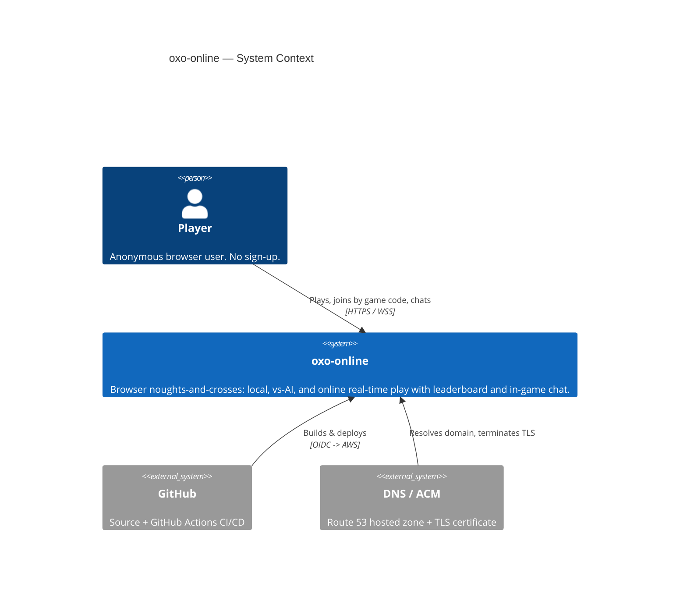
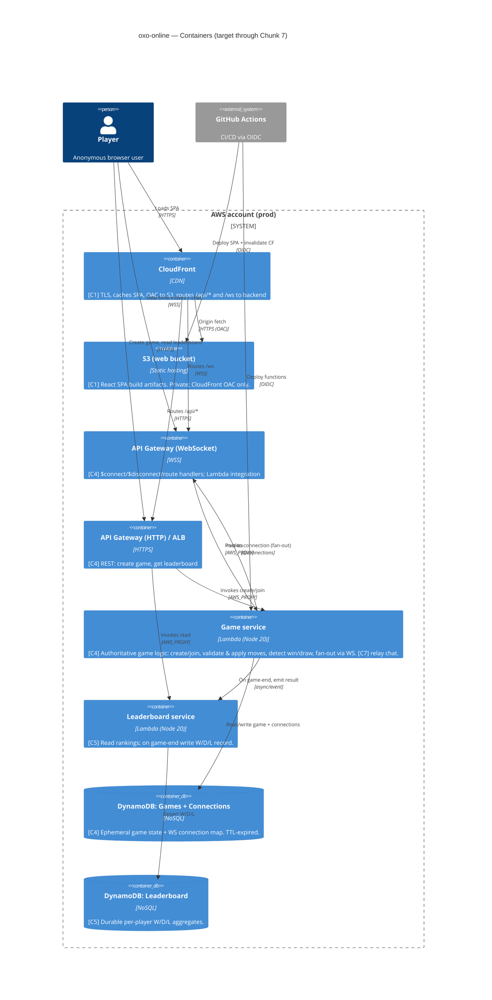

# Solution architecture — current (C4)

Follows AWS Well-Architected by default (Azure by exception — none taken here).
This is a **cloud/hosted** project. Diagrams are Mermaid C4. Only what is decided
is recorded; later chunks revise this when value is re-sliced.

> Architecture produced before `aws-architecture` skill existed; skill has since
> been created and the decisions here are consistent with it. See §11 reversal
> log in the skill for the oxo-online-specific deviations.

---

## Chunk-readiness legend

| Tag | Meaning | Status |
|-----|---------|--------|
| **[C1]** | Needed for Chunk 1 (deployable shell) | delivered (slice 001) |
| **[C2-3]** | Local game + AI — client-only, no new infra | **current** (C2 = slice 002, local game; C3 = AI, pending) |
| **[C4]** | Online match — first stateful backend + realtime | not started |
| **[C5]** | Leaderboard — first durable persistence | not started |
| **[C6]** | Player identity — session/display name | not started |
| **[C7]** | In-game chat — reuses C4 realtime transport | not started |

Minimum-to-deliver-value rule: nothing tagged later than the active chunk is
built. Chunks 1–3 ship with **no application backend at all**.

---

## C1 — System context

---

## C2 — Containers (full target)

---

## Key technology decisions (with rationale)

### Compute: serverless (Lambda) over ECS Fargate
- Chunks 1–3 need **no backend** — a static SPA proves deployment.
- The online workload (C4+) is spiky and low-volume (a hobby game). Lambda is
  scale-to-zero: no idle cost, no cluster/patching, fastest to a working URL.
- **WebSocket fan-out does NOT require a long-lived server.** API Gateway
  WebSocket holds the connections; Lambda is invoked per message and pushes via
  the `@connections` POST API. This removes the main historical reason to pick
  ECS for realtime.
- Reversal condition: if p95 move latency (target < 1s) is missed due to cold
  starts, move the game service to Fargate (provisioned, warm) behind the same
  API Gateway. The handler logic is transport-agnostic to keep this cheap.

### Realtime: API Gateway WebSocket over ECS long-lived connection
- Managed connection lifecycle, TLS, and auth hooks ($connect authorizer).
- No server to keep warm for idle games; connection state lives in DynamoDB, so
  any Lambda invocation can fan out to both players.
- Chat (C7) reuses the exact same transport — one `message` route, scoped by
  `gameId` — so chat adds no new infrastructure.

### Database: DynamoDB (two tables) over RDS
- **Game state is ephemeral** (one match, seconds to minutes): a single-item
  game document keyed by `gameId`, with **TTL auto-expiry** — no cleanup job,
  no relational schema. DynamoDB is the natural fit and scale-to-zero.
- **Leaderboard is a simple per-player aggregate** (W/D/L counts), read-mostly,
  small. DynamoDB with a GSI for ranking is sufficient; RDS would add a VPC,
  subnets, patching, and idle cost for no relational need.
- Connection map (WS connectionId -> gameId/player) is a DynamoDB item with TTL.
- Reversal condition: if leaderboard needs ranked queries beyond top-N or
  ad-hoc analytics, introduce RDS/Aurora Serverless or an OpenSearch projection.

### Frontend: React SPA on S3 + CloudFront
- Static artifact; CDN gives global low latency, TLS, and a real URL on day one.
- CloudFront is the single public origin and also routes `/api/*` and `/ws` so
  the SPA is same-origin (simplifies CORS and cookie/session scoping).
- **[C2] Local game lives entirely in the SPA** — a pure, framework-free game
  logic module (board, turn alternation, win/draw detection, reset) plus React
  Board/Cell/Status components. No network, no persistence, no backend; ships
  through the existing pipeline. See `architecture/deltas/002-local-game.md`.

### Game integrity: server-authoritative
- From C4 the **server owns the board**. Clients send a proposed move
  `(gameId, cell)`; the Game service validates turn ownership, legality, and
  game-not-over, then applies and fans out the new authoritative state. Clients
  never push board state — this defeats move forgery.

---

## Accounts & network

### Accounts
- **One AWS account** for prod to start (cheapest path to a real URL; matches
  "prod-only" capability). Organisation/SCP and a separate `staging` account are
  a reversal item once change-failure rate justifies a pre-prod stage.
- All cross-account trust to GitHub is via **OIDC federation** (no long-lived
  IAM user keys).

### Network
- **No customer-facing VPC for C1–C7 as designed.** All compute is Lambda with
  AWS-managed networking; S3/DynamoDB/API Gateway are regional managed services
  reached over the AWS network. There are **no public EC2/ECS instances, no
  inbound security groups to manage** — the public attack surface is CloudFront
  + the two API Gateways only.
- If the compute reversal to ECS Fargate is taken: introduce a VPC with private
  subnets (Fargate tasks, no public IP), an ALB in public subnets, NAT or VPC
  endpoints for DynamoDB/S3, and least-privilege security groups (ALB ->task on
  the app port only). Documented now so the delta is small if needed.

### Edge & TLS
- Route 53 hosted zone -> CloudFront distribution; ACM certificate (us-east-1)
  for the domain. TLS 1.2+ enforced at CloudFront and both API Gateways.

---

## IAM — least-privilege roles (one per responsibility)

| Role | Trusted by | Allowed (scoped) |
|------|-----------|------------------|
| `oxo-cf-oac` | CloudFront (OAC) | `s3:GetObject` on the web bucket only |
| `oxo-deploy` | GitHub OIDC | `s3:PutObject`/`DeleteObject` on web bucket, `cloudfront:CreateInvalidation`, `lambda:UpdateFunctionCode`, scoped by resource ARN + repo/branch claim |
| `oxo-game-fn` | Lambda (game) | RW `Games`+`Connections` tables; `execute-api:ManageConnections` on the WS API; invoke/emit to leaderboard; CloudWatch Logs |
| `oxo-board-fn` | Lambda (leaderboard) | RW `Leaderboard` table; read `Games`; CloudWatch Logs |
| `oxo-ws-authorizer` | Lambda ($connect) | none beyond logs (validates connect params) |

No wildcards on resources; every policy is table-/bucket-/function-ARN scoped.
Deploy role is constrained to the repo and branch via the OIDC `sub` condition.

---

## Well-Architected notes (only what's decided)

- **Security:** server-authoritative game logic; OIDC (no static keys); OAC
  (S3 never public); encryption at rest (S3 SSE, DynamoDB default) and in transit
  (TLS/WSS everywhere); per-service least-privilege roles; WAF on CloudFront +
  API Gateway for rate-limiting anonymous abuse (added at C4/C5). See
  `architecture/security/`.
- **Reliability:** all managed, multi-AZ services; DynamoDB TTL self-heals
  orphaned game/connection state; idempotent move application keyed by
  `(gameId, moveSeq)`.
- **Performance:** CDN for the SPA; DynamoDB single-item reads; move latency
  budget < 1s p95 (cold-start reversal noted above); AI runs **client-side**
  (C3) so the < 200ms target needs no backend round-trip.
- **Cost:** scale-to-zero everywhere; no idle EC2/RDS/NAT; TTL avoids storage
  growth; on-demand DynamoDB.
- **Operational excellence:** single CI/CD pipeline (GitHub Actions); IaC for
  all resources; structured CloudWatch logs; deploy via artifact swap with
  CloudFront invalidation.

---

## C3 — Components

Deferred. Single Game-service handler with route-based dispatch
($connect/$disconnect/move/chat) does not yet warrant component decomposition.
Revisit if chat (C7) and move-relay logic diverge enough to split handlers.
