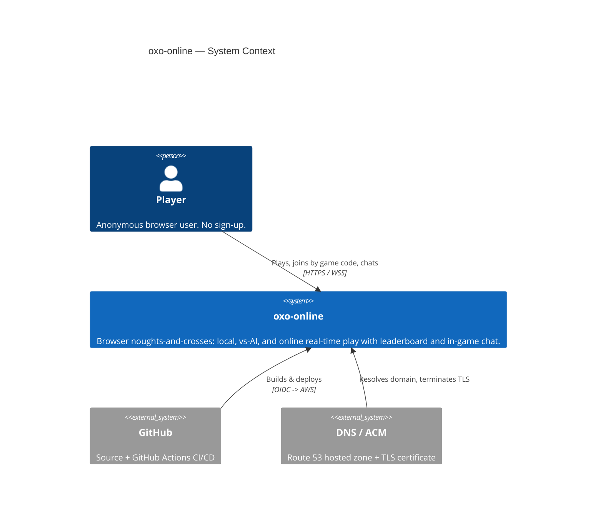
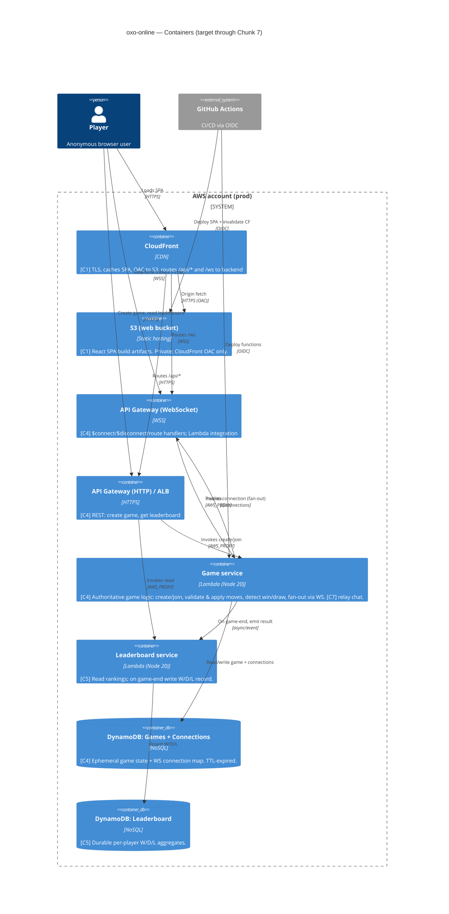

# Solution architecture — current (C4)

Follows AWS Well-Architected by default (Azure by exception — none taken here).
This is a **cloud/hosted** project. Diagrams are Mermaid C4. Only what is decided
is recorded; later chunks revise this when value is re-sliced.

> Architecture produced before `aws-architecture` skill existed; skill has since
> been created and the decisions here are consistent with it. See §11 reversal
> log in the skill for the oxo-online-specific deviations.

---

## Chunk-readiness legend

| Tag | Meaning | Status |
|-----|---------|--------|
| **[C1]** | Needed for Chunk 1 (deployable shell) | delivered (slice 001) |
| **[C2-3]** | Local game + AI — client-only, no new infra | **current** (C2 = slice 002, local game, delivered; C3 = AI, in progress) |
| **[C4]** | Online match — first stateful backend + realtime | s004 create ✓; s005 join/WS ✓; s005-h2 connect-auth ✓; s006 move relay + server-authoritative win/draw ✓; s007 $disconnect abandon+notify ✓; s008 share-link deep-route ✓ COMPLETES C4; **s005-h3 code-uniqueness (Codes reservation table, OI-3) — current, FINAL C4 hardening residual** |
| **[C5]** | Leaderboard — first durable persistence + first DynamoDB Stream | **current** — s009 arcade-scoreboard (name entry + Stream-driven tally + shared read board) in planning; s010 = ≤10s latency Playwright smoke (done-condition proof, may fold into s009) |
| **[C6]** | Player identity — session/display name | **REMOVED from plan** — absorbed by the s009 arcade name-as-key model (display names delivered in s009; no committed cross-device-identity job). See slice.md C5/C6 reshape note. |
| **[C7]** | In-game chat — reuses C4 realtime transport | not started |

Minimum-to-deliver-value rule: nothing tagged later than the active chunk is
built. Chunks 1–3 ship with **no application backend at all**.

---

## C1 — System context



---

## C2 — Containers (full target)



---

## C4 — what is actually built (in-progress subset of the target above)

The C2 diagram is the **target through Chunk 7**. As of slice 006 the *built*
subset is narrower; this section is the source of truth for "what exists now".

```mermaid
C4Container
  title oxo-online — Built as of s006 (C4 in progress)

  Person(player, "Player", "Anonymous browser user")

  System_Boundary(aws, "AWS account (prod)") {
    Container(wafg, "WAFv2 WebACL (global)", "us-east-1 CLOUDFRONT scope", "[s005-h1] rate 100/5min/IP + IP-reputation; assoc. to distribution. Lives in NEW OxoOnlineWafUsEast1 stack. [s007/IMP-008] +oxo-test-runner-ips IP set; rate rule scope-down NOT(IPSet) excludes transient runner IPs (Block+limit unchanged for all others).")
    Container(cf, "CloudFront", "CDN", "[built s001/s004; s005-h1 webAclId set] SPA + /api/* behaviour (CachingDisabled). NO WS proxying.")
    Container(s3, "S3 web bucket", "Static hosting", "[built s001] React SPA; private, OAC only. s005 adds runtime wsUrl config artifact.")

    Container(httpapi, "API Gateway (HTTP)", "HTTPS", "[built s004] POST /games (create). NO stage WebACL (CF WAF covers /api/*).")
    Container(wsapi, "API Gateway (WebSocket)", "WSS", "[s005] prod stage; routes $connect/$disconnect/register/join. [s006] +move route (5 keys, no $default). [s007] $disconnect stub -> REAL (abandon+notify+clean up); route count unchanged. [s005-h2] $connect has a REQUEST Lambda authorizer (NO result cache — strike 4). NO WAF (WAFv2 cannot assoc. API GW v2 — GATE-AMEND-H1-A); flood control = stage throttle 20/40 + reserved-concurrency + per-IP authorizer budget.")

    Container(gamefn, "oxo-game-fn", "Lambda Node20", "[built s004] create-game; PutItem on Games. [s005-h2] also mints host wsToken (HMAC); reads shared secret. [s005-h3] RESERVES code via conditional PutItem on Codes (attribute_not_exists) BEFORE Games write; collision => fresh-code retry (<=5) then 5xx WE own (never a wrong code). Client contract {gameId,code,wsToken} unchanged.")
    Container(wsfn, "oxo-ws-fn", "Lambda Node20", "[s005] $connect/register/join; conditional join write + game-ready fan-out. [s006] +move route: validates turn/legality/status by connectionId binding, atomic conditional UpdateItem with version CAS, server-side win/draw, board-update/game-over relay to the 2 bound conns. [s007] $disconnect REAL: GetItem(Connections, OWN connId)->gameId; conditional UpdateItem status active->abandoned (won/drawn guard); 1 survivor notify (0 on terminal/waiting); delete row. +ONE IAM grant: GetItem on Connections only (else s006 set).")
    Container(wsauthfn, "oxo-ws-auth-fn", "Lambda Node20", "[s005-h2] $connect REQUEST authorizer: verify host wsToken / lookup guest code; per-IP budget; Allow/Deny IAM policy. NO ManageConnections, NO Games write.")

    ContainerDb(ddb_game, "DynamoDB: Games", "NoSQL", "[built s004] +code GSI & host/guest connId attrs (s005). [s006] +board(9-char)/currentTurn/winner/version(opt-lock CAS)/moveCount attrs. [s009] +hostName/guestName attrs (server-normalised ≤10/charset/AAA-default) + STREAM enabled (NEW_AND_OLD_IMAGES; consumed by oxo-board-fn). TTL 24h, SSE, on-demand.")
    ContainerDb(ddb_conn, "DynamoDB: Connections", "NoSQL", "[s005] connectionId -> gameId/role. TTL 2h, SSE, on-demand. [s007] +GetItem read by $disconnect (own row by PK) — schema unchanged.")
    ContainerDb(ddb_attempts, "DynamoDB: ConnectAttempts", "NoSQL", "[s005-h2] sourceIp -> count. TTL 5min, SSE, on-demand. Best-effort per-IP connect budget.")
    ContainerDb(ddb_codes, "DynamoDB: Codes", "NoSQL", "[s005-h3] PK=code. Conditional PutItem attribute_not_exists(code) = single-item CAS => storage-enforced code uniqueness (OI-3). WRITE-TIME GATE only; NOT on join/lookup read path (join still uses Games code-index). TTL 24h, lazy deletion, SSE, on-demand, no GSI.")
    Container(secret, "WS-token secret", "SSM SecureString / Secret", "[s005-h2] 32-byte HMAC key. Encrypted at rest; read-scoped to oxo-game-fn (mint) + oxo-ws-auth-fn (verify) only.")

    Container(boardfn, "oxo-board-fn", "Lambda Node20", "[s009] DynamoDB-Stream consumer on Games. Reads OLD+NEW image FROM THE RECORD (no Games table read); computes outcome; TWO conditional UpdateItem on Leaderboard (ADD tally + ADD scoredGames{gameId}, COND NOT contains(scoredGames,:gameId)) = idempotent CAS. ConditionalCheckFailed=replay, swallow. OFF the hot path.")
    ContainerDb(ddb_board, "DynamoDB: Leaderboard", "NoSQL", "[s009] FIRST DURABLE store. PK=playerName (entered name IS the key; collisions accumulate, SM-2). wins/draws/losses (N, ADD) + scoredGames (SS, idempotency marker). NO TTL (standings persist). PITR ENABLED. SSE, on-demand, no GSI (top-N Scan).")
  }

  Rel(player, cf, "Loads SPA + reads wsUrl config", "HTTPS")
  Rel(wafg, cf, "Inspects/rate-limits all requests", "WAF assoc")
  Rel(cf, s3, "Origin fetch", "HTTPS (OAC)")
  Rel(cf, httpapi, "Routes /api/*", "HTTPS")
  Rel(player, httpapi, "POST /api/games (create) -> {gameId, code, wsToken}", "HTTPS via CF")
  Rel(player, wsapi, "Direct WSS: $connect?wsToken|?code, then register/join", "WSS (NOT via CloudFront)")

  Rel(httpapi, gamefn, "Invokes create", "AWS_PROXY")
  Rel(wsapi, wsauthfn, "$connect REQUEST authorizer (Allow/Deny)", "AWS authorizer")
  Rel(wsapi, wsfn, "Invokes per message (only after Allow)", "AWS_PROXY")
  Rel(gamefn, secret, "Read HMAC secret (mint wsToken)")
  Rel(wsauthfn, secret, "Read HMAC secret (verify wsToken)")
  Rel(wsauthfn, ddb_game, "GetItem code-index (guest code path)")
  Rel(wsauthfn, ddb_attempts, "UpdateItem ADD (per-IP budget)")
  Rel(gamefn, ddb_codes, "[s005-h3] conditional PutItem reserve (attribute_not_exists), BEFORE Games write; collision => retry")
  Rel(gamefn, ddb_game, "PutItem (create, AFTER reserve succeeds)")
  Rel(wsfn, ddb_game, "Query code-index + conditional UpdateItem (join/register); [s006] GetItem board + move CAS UpdateItem")
  Rel(wsfn, ddb_conn, "Put/Delete connection; [s007] GetItem own row on $disconnect (connId->gameId)")
  Rel(wsfn, wsapi, "game-ready + [s006] board-update/game-over fan-out to the 2 bound conns; [s007] $disconnect = EXACTLY 1 opponent-disconnected post to survivor (0 on terminal/waiting; 410=swallow, no retry)", "@connections (ManageConnections, this API ARN only)")

  Rel(ddb_game, boardfn, "[s009] active->won/drawn transition record via Stream (at-least-once)", "DynamoDB Stream")
  Rel(boardfn, ddb_board, "[s009] idempotent conditional UpdateItem tally (ADD + scoredGames marker)")
  Rel(httpapi, gamefn, "[s009] GET /api/leaderboard read route", "AWS_PROXY")
  Rel(gamefn, ddb_board, "[s009] Scan top-N (read-only)")
}
```

**Not yet built (target only):** reconnect-after-reload (OI-10 ruled OUT of s007,
unscheduled), CloudFront WS proxying, in-game chat (C7). **Leaderboard table +
`oxo-board-fn` + Games Stream + `GET /api/leaderboard` are NOW DESIGNED (s009 /
delta 010, C5) — in planning, not yet deployed.** **WAF built (s005-h1); `$connect` capability-token + per-IP
authorizer built (s005-h2); move relay + server-authoritative win/draw built
(s006); `$disconnect` abandon+notify+clean-up built (s007).** See deltas 005+/006/
007 for the deferral list.

**Key s005-h2 (connect-auth) architectural facts:**
- First **Lambda REQUEST authorizer** on the WS API (new-mechanism, §30 probe
  required). It gates `$connect`: host presents an HMAC `wsToken` (minted in the
  `POST /api/games` response, 60s exp), guest presents `?code`; the authorizer
  Allows/Denies via an **IAM-policy response** (WS APIs use the REST-style
  `{principalId, policyDocument}` shape, **NOT** the HTTP-v2 simple
  `{isAuthorized}` shape — pinned). Cache TTL = 0.
- **Separate function** `oxo-ws-auth-fn` (not folded into `oxo-ws-fn`) for
  disjoint least-privilege: it gates but cannot act on game state.
- **Per-IP budget** via `ConnectAttempts` (sourceIp PK, 5-min TTL) — best-effort
  (read-less counter; IP-cycling caveat). This is the per-IP control WAFv2 cannot
  provide for a v2 API (h1 reversal-log row now implemented).
- **Shared HMAC secret** in one SSM SecureString / Secret, read-scoped to
  `oxo-game-fn` (mint) + `oxo-ws-auth-fn` (verify) only; never in plaintext env.
- All eu-west-2; in `OxoGameProd`; **no new deploy-role grant** (authorizer +
  table are CDK/CFN-managed under bootstrap trust); **no manual deploy step**
  (secret is generated in-stack). Deploy order unchanged.
- See `architecture/deltas/s005-h2-connect-auth.md`,
  `architecture/security/lambda-authorizer.md`,
  `architecture/security/dynamodb-connectattempts.md`.

**Key s005-h1 (WAF) architectural facts (AMENDED 2026-06-06, GATE-AMEND-H1-A):**
- **Option A rescope:** WAFv2 **cannot** associate with API Gateway **v2** APIs.
  The planned **regional WS WebACL + association is REMOVED** (rejected at deploy
  with invalid-ARN). WS connection-flood control is now the existing WS prod
  **stage throttle (rate 20 / burst 40, account/stage-level)** + reserved
  concurrency + 2h Connections TTL; **per-IP** WS protection is re-scoped to the
  **s005-h2 `$connect` authorizer** (code-level, can rate-limit on source IP).
- A **NEW us-east-1 stack `OxoOnlineWafUsEast1`** holds the global
  CloudFront-scope WebACL (CloudFront WAF must live in us-east-1; all other
  stacks are eu-west-2). Its ARN flows to `OxoOnlineProd` via CDK
  `crossRegionReferences` and is set as the distribution `webAclId` — a
  cross-stack/cross-region §30 contract pinned by SYNTH-CONTRACT-WAF-1.
  Deploy order: `OxoOnlineWafUsEast1` → `OxoOnlineProd`. WAF is default-allow
  (no app-code/data-flow change). `OxoGameProd` carries no WAF resource now.
- See `architecture/deltas/s005-h1-waf.md` §0 and `architecture/security/wafv2.md`.

**Key s006 (move relay + server-authoritative play) architectural facts:**
- **One new WS route `move`** on the EXISTING WS API → the EXISTING `oxo-ws-fn`
  (route count 4→5; still no `$default`). **No new function, no new table, no
  new API, no new principal, no new IAM grant, no new region, no new
  deploy-role grant.** The thinnest possible delta for the core-job payoff.
- **Server-authoritative move:** the `move` handler derives the sender's role
  from the `connectionId`↔game binding (`event.requestContext.connectionId` must
  equal `hostConnectionId` or `guestConnectionId` of THIS game) — never a
  client-claimed role. It validates turn/square-free/`status=active`, then writes.
- **Atomic conditional `UpdateItem` with optimistic-lock CAS:** the same write is
  the turn gate, the legality gate, AND the lock — `ConditionExpression`
  `status='active' AND currentTurn=senderRole AND version=:expected`; on success
  it increments `version`, replaces `board`, flips `currentTurn`, and (if
  terminal) flips `status`→`won`/`drawn` + sets `winner` in the SAME write. So
  **reaching game-over and locking the board is one atomic op** — no
  post-game-over move can slip in. Concurrent move writes are serialized by
  `version` (no lost move / no double-fill).
- **Bounded relay:** an accepted non-terminal move = **exactly 2** `@connections`
  POSTs (board-update to host+guest); terminal ≤ 4; a rejected move = **1** post
  (move-rejected to sender) + **0** writes. No broadcast. `ManageConnections`
  grant is the s005 one, **unchanged**.
- **SPA renders only server broadcasts** (no optimistic update). OI-33 folded in:
  WS error reason `code-not-found` maps to a readable "Game not found" message
  (one-line SPA change, no Lambda/API touch).
- See `architecture/deltas/006-move-relay.md`,
  `architecture/dependencies/data-flow.mmd` (FIRST edition, OI-31),
  `architecture/security/apigw-websocket.md` (s006 section),
  `architecture/security/dynamodb-games.md` (s006 additions).

**Key s007 ($disconnect abandon + notify + clean up) architectural facts:**
- **The EXISTING `$disconnect` stub becomes REAL** on the EXISTING `oxo-ws-fn`.
  **No new route** (count stays 5, no `$default`), **no new function, no new
  table, no new API, no new principal, no new region, no new deploy-role grant.**
- **ONE IAM grant added** (the only permission change in the slice):
  `dynamodb:GetItem` on the **`Connections` table ARN only** — `$disconnect` must
  resolve the disconnecting `connectionId → gameId` (that binding lives only in
  `Connections`; the move path stays Connections-read-free). Single-PK read of the
  connection's OWN row; no `Query`/`Scan`. `ManageConnections`/`UpdateItem`(Games)/
  `DeleteItem`(Connections) **unchanged**.
- **Conditional abandon — won/drawn never overwritten:** a single atomic
  `UpdateItem` with `ConditionExpression status='active'`, `SET status='abandoned'`.
  A terminal/`waiting`/already-abandoned game fails the condition → no write,
  swallowed (the won/drawn guard is the condition, same CAS discipline as s006).
- **Bounded notification:** an active-game disconnect = **EXACTLY 1**
  `@connections` post (`opponent-disconnected` to the survivor); terminal/waiting/
  survivor-`GoneException` = **0**. A survivor 410 is swallowed with **no retry**
  (both gone). Never a broadcast.
- **No force-abandon spoof:** the `$disconnect` event carries only the
  disconnecting connection's OWN platform-set `connectionId` (no client body) — a
  client cannot abandon another's game. **connectionId IS the identity.**
- **Idle timeout = APIGW 10-min idle close** fires the same `$disconnect` path; no
  custom keepalive. 2h `Connections` TTL + 24h `Games` TTL are the backstops.
- **OR-S006-b re-worded (OI-10 ruling):** relay-loss recovery is **abandon +
  survivor-notify (s007), NOT reconnect-replay**; reconnect is unscheduled.
- **IMP-008 (cicd/infra, not the app data plane):** a `oxo-test-runner-ips` WAF
  IP set in the existing us-east-1 WAF stack; the CloudFront rate rule gains a
  `NOT(IPSet)` scope-down so transient runner IPs bypass the count while Block +
  limit stay unchanged for all other IPs (AC3.1 preserved). Mutation is
  deploy-role/runner-script only; entries are transient (added per-run, removed by
  `trap`, drained ≤24h by a scheduled Lambda — the s007 cicd capability step).
- See `architecture/deltas/007-disconnect.md`,
  `architecture/dependencies/data-flow.mmd` (s007 marks),
  `architecture/security/apigw-websocket.md` (s007 section),
  `architecture/security/dynamodb-connections.md` (s007 GetItem addition),
  `architecture/security/dynamodb-games.md` (s007 abandon transition),
  `architecture/security/wafv2.md` (IMP-008 IP set).

**Key s009 (arcade scoreboard — C5, first durable store + first DynamoDB Stream) facts:**
- **First DURABLE store `Leaderboard`** (PK=`playerName`, NO TTL, PITR enabled) +
  **first DynamoDB Stream** in the system → **NEW platform mechanism, §30
  walking-skeleton probe required** (Probe A: real game-over → exactly one tally
  increment; Probe B: replay → no double-count). The engineer runs both through
  the DEPLOYED stream path BEFORE use-case build-out.
- **Result recording = DynamoDB Stream on `Games`, NOT inline.** Stream
  (NEW_AND_OLD_IMAGES) → new principal `oxo-board-fn` via event-source mapping,
  filtered to the `active→won/drawn` TRANSITION (excludes board-update MODIFYs and
  `abandoned` → SM-5). Zero hot-path change (SM-6 game-over WS ≤1s p95 untouched);
  board-fn failure does not fail the game.
- **Idempotency under at-least-once stream delivery (SM-4, the crux):** each
  participant's tally is written by a **conditional `UpdateItem`** that does
  `ADD wins :one, ADD scoredGames {gameId}` with
  `ConditionExpression NOT contains(scoredGames, :gameId)` — increment AND mark in
  ONE atomic single-item CAS, co-located on the name row. A replayed game-over
  fails the condition → no double-count; `ConditionalCheckFailed` is treated as
  already-done (swallow). Per-name marker (not a separate ProcessedGames table) so
  the check and the increment can never split across two items.
- **Name-as-key, unauthenticated:** the entered name IS the key; collisions
  accumulate on one row BY DESIGN (SM-2). Name captured at create (`POST /api/games`
  body `playerName`, additive) and join (WS `join` frame `playerName`, additive),
  written onto `Games` `hostName`/`guestName` BEFORE game-over via the EXISTING
  create/join writes (no new grant). Server-normalised (trim, ≤10, charset-bound,
  `"AAA"` default — SM-3).
- **Read path:** `GET /api/leaderboard` (NEW route on the existing HTTP API) →
  existing `oxo-game-fn` (Scan-only top-20) → CloudFront **5s-TTL** cache behaviour
  (meets SM-1 ≤10s; `POST /api/games` stays CachingDisabled). Response carries
  `buildSha` (version-identifiable).
- **STORED-XSS control (§9a-accepted):** a free-text name rendered in other
  browsers is the one material new surface. Defence-in-depth: SPA renders names as
  ESCAPED TEXT (React default) with an explicit **no-`dangerouslySetInnerHTML`**
  code-policy pin + server-side length/charset bound at the write boundary, behind
  the unchanged CSP. Impersonation + offensive-name abuse are INHERENT to the
  product-chosen unauthenticated arcade model — acknowledged, moderation out of
  scope. **Security review §9a AUTO-ACCEPT** (no human flag).
- **IAM no-widening:** only new app-data grants are `oxo-board-fn` (stream-read +
  Leaderboard `UpdateItem`) and `oxo-game-fn` (Leaderboard `Scan`); **`oxo-ws-fn`
  gains NOTHING**; `oxo-deploy` += scoped `UpdateFunctionCode` on board-fn ARN only,
  no `iam:*`. All eu-west-2 (no region exception). See
  `architecture/deltas/010-arcade-scoreboard.md`,
  `architecture/security/dynamodb-leaderboard.md`,
  `architecture/security/lambda-execution-roles.md` (s009),
  `architecture/security/apigw-http.md` (s009),
  `architecture/security/cloudfront-distribution.md` (s009),
  `architecture/security/dynamodb-games.md` (s009 stream + name attrs).

**Key s005 architectural facts:**
- The WebSocket API is in the **same `OxoGameProd` stack** as the HTTP API +
  `Games` table (one game-backend deployable; no new cross-stack data-plane
  import). See `architecture/deltas/005-join-game.md` for the stack-placement
  rationale and the §30 wss-URL-handoff contract.
- The SPA connects **directly** to the WSS endpoint; the wss URL is injected as
  **runtime config** at deploy time from `OxoGameProd-WsApiEndpoint`. CloudFront
  is NOT in the WS path.

---

## Key technology decisions (with rationale)

### Compute: serverless (Lambda) over ECS Fargate
- Chunks 1–3 need **no backend** — a static SPA proves deployment.
- The online workload (C4+) is spiky and low-volume (a hobby game). Lambda is
  scale-to-zero: no idle cost, no cluster/patching, fastest to a working URL.
- **WebSocket fan-out does NOT require a long-lived server.** API Gateway
  WebSocket holds the connections; Lambda is invoked per message and pushes via
  the `@connections` POST API. This removes the main historical reason to pick
  ECS for realtime.
- Reversal condition: if p95 move latency (target < 1s) is missed due to cold
  starts, move the game service to Fargate (provisioned, warm) behind the same
  API Gateway. The handler logic is transport-agnostic to keep this cheap.

### Realtime: API Gateway WebSocket over ECS long-lived connection
- Managed connection lifecycle, TLS, and auth hooks ($connect authorizer).
- No server to keep warm for idle games; connection state lives in DynamoDB, so
  any Lambda invocation can fan out to both players.
- Chat (C7) reuses the exact same transport — one `message` route, scoped by
  `gameId` — so chat adds no new infrastructure.

### Database: DynamoDB (two tables) over RDS
- **Game state is ephemeral** (one match, seconds to minutes): a single-item
  game document keyed by `gameId`, with **TTL auto-expiry** — no cleanup job,
  no relational schema. DynamoDB is the natural fit and scale-to-zero.
- **Leaderboard is a simple per-player aggregate** (W/D/L counts), read-mostly,
  small. DynamoDB with a GSI for ranking is sufficient; RDS would add a VPC,
  subnets, patching, and idle cost for no relational need.
- Connection map (WS connectionId -> gameId/player) is a DynamoDB item with TTL.
- Reversal condition: if leaderboard needs ranked queries beyond top-N or
  ad-hoc analytics, introduce RDS/Aurora Serverless or an OpenSearch projection.

### Frontend: React SPA on S3 + CloudFront
- Static artifact; CDN gives global low latency, TLS, and a real URL on day one.
- CloudFront is the single public origin and also routes `/api/*` and `/ws` so
  the SPA is same-origin (simplifies CORS and cookie/session scoping).
- **[C2] Local game lives entirely in the SPA** — a pure, framework-free game
  logic module (board, turn alternation, win/draw detection, reset) plus React
  Board/Cell/Status components. No network, no persistence, no backend; ships
  through the existing pipeline. See `architecture/deltas/002-local-game.md`.
- **[C3] AI opponent lives entirely in the SPA** — a pure minimax module plays O
  against the human (X), composed with the existing engine; plus a mode selector.
  No network, no persistence, no backend, no infra/IAM change. < 200ms client-side.
  See `architecture/deltas/003-ai-opponent.md`.
- **[s008] Share-link is CLIENT-ONLY (arch-lite)** — the SPA gains a React Router
  route `/join/:code` (URL-param pre-fill + one-click join, reusing the existing
  WS `$connect?code`+`join` path) and a copy-to-clipboard control. **No backend,
  no infra, no IAM, no CloudFront/WAF/CSP change.** It relies on the EXISTING
  CloudFront `errorResponses` SPA-fallback (403/404→200+`/index.html`, in
  `oxo-online-shell-stack.ts`) to serve the unknown `/join/<code>` path so React
  Router can route it client-side — VERIFIED at the CDK source, not assumed. The
  code-in-a-shareable-URL is the SAME OR-H2-b capability credential already shown
  on screen and typed, in a different carrier — threat model unchanged. WS stays
  DIRECT (OI-5 single-origin WS proxying remains NOT required). §9a auto-accept.
  See `architecture/deltas/008-share-link.md`.

### Game integrity: server-authoritative
- From C4 the **server owns the board**. Clients send a proposed move
  `(gameId, cell)`; the Game service validates turn ownership, legality, and
  game-not-over, then applies and fans out the new authoritative state. Clients
  never push board state — this defeats move forgery.

---

## Accounts & network

### Accounts
- **One AWS account** for prod to start (cheapest path to a real URL; matches
  "prod-only" capability). Organisation/SCP and a separate `staging` account are
  a reversal item once change-failure rate justifies a pre-prod stage.
- **Regions:** primary **eu-west-2**. As of s005-h1 a **second region us-east-1**
  carries only the `OxoOnlineWafUsEast1` stack (CloudFront-scope WebACL must live
  in us-east-1) — same account, control-plane only, no data plane in us-east-1.
- All cross-account trust to GitHub is via **OIDC federation** (no long-lived
  IAM user keys).

### Network
- **No customer-facing VPC for C1–C7 as designed.** All compute is Lambda with
  AWS-managed networking; S3/DynamoDB/API Gateway are regional managed services
  reached over the AWS network. There are **no public EC2/ECS instances, no
  inbound security groups to manage** — the public attack surface is CloudFront
  + the two API Gateways only.
- If the compute reversal to ECS Fargate is taken: introduce a VPC with private
  subnets (Fargate tasks, no public IP), an ALB in public subnets, NAT or VPC
  endpoints for DynamoDB/S3, and least-privilege security groups (ALB ->task on
  the app port only). Documented now so the delta is small if needed.

### Edge & TLS
- Route 53 hosted zone -> CloudFront distribution; ACM certificate (us-east-1)
  for the domain. TLS 1.2+ enforced at CloudFront and both API Gateways.

---

## IAM — least-privilege roles (one per responsibility)

| Role | Trusted by | Allowed (scoped) |
|------|-----------|------------------|
| `oxo-cf-oac` | CloudFront (OAC) | `s3:GetObject` on the web bucket only |
| `oxo-deploy` | GitHub OIDC | `s3:PutObject`/`DeleteObject` on web bucket, `cloudfront:CreateInvalidation`, `lambda:UpdateFunctionCode`, scoped by resource ARN + repo/branch claim. **s005-h1 (amended GATE-AMEND-H1-A):** + scoped `wafv2:` Create/Get/Update/Delete/List/Tag (CloudFront WebACL mgmt) and `cloudfront:UpdateDistribution`/`GetDistribution`/`GetDistributionConfig` (no `wafv2:*`/`cloudfront:*` wildcard; no `iam:*`). The `wafv2:Associate`/`Disassociate`/`ListResourcesForWebACL` grants are **dropped** — the regional WS association is removed (WAFv2 cannot associate API GW v2). See `DEPLOY_ROLE_EXTENSIONS.md`. |
| `oxo-game-fn` | Lambda (create + leaderboard read) | **s004 built:** `dynamodb:PutItem` on `Games` ARN only + own log group. **s005-h2:** + secret read (`ssm:GetParameter`+`kms:Decrypt` or `secretsmanager:GetSecretValue`) on the **one** shared WS-token secret ARN only (mints host `wsToken`). **s005-h3:** + **exactly** `dynamodb:PutItem` on the **`Codes` table ARN only** — **no** `DeleteItem`/`GetItem`/`Query`/`Scan`/`UpdateItem` on `Codes`, no GSI, no wildcard. **s009:** + **exactly** `dynamodb:Scan` on the **`Leaderboard` table ARN only** (the `GET /api/leaderboard` read) — **no** `Query`/`UpdateItem`/`DeleteItem`/`GetItem` on `Leaderboard`. The `hostName` write rides the existing `Games` `PutItem` (no new grant). |
| `oxo-ws-fn` | Lambda (WS join/register/move/$disconnect) | **s005:** `GetItem`/`Query` on `Games` `code-index` GSI; conditional `UpdateItem` on `Games`; `PutItem`/`DeleteItem` on `Connections`; `execute-api:ManageConnections` on **this WS API ARN only**; own log group. **s007:** + **exactly** `dynamodb:GetItem` on the **`Connections` table ARN only** (the `$disconnect` connectionId→gameId read) — **no** `Query`/`Scan`, no second table, no `*`. **No** secret read, **no** `ConnectAttempts` access. |
| `oxo-board-fn` | Lambda (Games-stream consumer) | **s009 built:** `dynamodb:GetRecords`/`GetShardIterator`/`DescribeStream`/`ListStreams` on the **`Games` STREAM ARN only** + `dynamodb:UpdateItem` on the **`Leaderboard` table ARN only** + own log group. **NO** Games table grant (reads OLD+NEW from the stream record), **NO** `Scan`/`Query`/`GetItem`/`DeleteItem`/`PutItem` on `Leaderboard`, **NO** `execute-api`, **NO** secret, **NO** wildcard. (NARROWER than the C5-target "RW Leaderboard, read Games" — least-privilege per actual use.) |
| `oxo-ws-auth-fn` | Lambda ($connect REQUEST authorizer) | **s005-h2 built:** `GetItem`/`Query` on `Games` `code-index` GSI (guest code path); `UpdateItem`/`PutItem` on `ConnectAttempts` only; secret read on the **one** shared WS-token secret ARN; own log group. **NO** `execute-api:ManageConnections`, **NO** `Games` write, **NO** `Connections` access, **NO** `iam:*`/wildcard. Disjoint from `oxo-ws-fn` (least-privilege gate). |

No wildcards on resources; every policy is table-/index-/bucket-/function-/
API-ARN scoped. Deploy role is constrained to the repo and branch via the OIDC
`sub` condition, gains scoped `lambda:UpdateFunctionCode`/`GetFunction` on the
`oxo-ws-fn` ARN (s005) and the `oxo-board-fn` ARN (s009), and still has NO
`iam:*` mutation actions (the new board-fn role + Games stream + Leaderboard
table are CDK-synthesised under existing bootstrap trust).

---

## Well-Architected notes (only what's decided)

- **Security:** server-authoritative game logic; OIDC (no static keys); OAC
  (S3 never public); encryption at rest (S3 SSE, DynamoDB default) and in transit
  (TLS/WSS everywhere); per-service least-privilege roles; **WAFv2 rate-limiting
  (s005-h1, amended GATE-AMEND-H1-A):** global WebACL on CloudFront (`/api/*`,
  100/5min/IP, + IP-reputation managed group, default-allow). **No WS WebACL** —
  WAFv2 cannot associate API GW v2; WS flood control = stage throttle (20/40,
  account-level) + reserved-concurrency + Connections TTL. **Per-IP WS protection
  and the `$connect` capability-token authorizer are BUILT in s005-h2**
  (`oxo-ws-auth-fn`: host HMAC `wsToken` / guest `code` gate + best-effort per-IP
  budget via `ConnectAttempts`; the per-IP control WAFv2 cannot give a v2 API).
  No WebACL on the HTTP API stage (CF ACL covers the path). See
  `architecture/security/wafv2.md`, `architecture/security/lambda-authorizer.md`,
  `architecture/security/dynamodb-connectattempts.md`.
- **Reliability:** all managed, multi-AZ services; DynamoDB TTL self-heals
  orphaned game/connection state; idempotent move application keyed by
  `(gameId, moveSeq)`. **[s009]** `Leaderboard` has **PITR enabled** (first durable
  store; no TTL); the Stream-driven tally write is **idempotent under at-least-once
  delivery** via a per-name conditional `scoredGames` marker (a replayed game-over
  cannot double-count) — the board converges late on a board-fn failure, never
  breaks play.
- **Performance:** CDN for the SPA; DynamoDB single-item reads; move latency
  budget < 1s p95 (cold-start reversal noted above); AI runs **client-side**
  (C3) so the < 200ms target needs no backend round-trip.
- **Cost:** scale-to-zero everywhere; no idle EC2/RDS/NAT; TTL avoids storage
  growth; on-demand DynamoDB.
- **Operational excellence:** single CI/CD pipeline (GitHub Actions); IaC for
  all resources; structured CloudWatch logs; deploy via artifact swap with
  CloudFront invalidation.

---

## C3 — Components

Still a single `oxo-ws-fn` handler with route-based dispatch
(`$connect`/`$disconnect`/`register`/`join`/`move`). s006 keeps it one function
but introduces **internal hexagonal ports** (OI-17): a pure move/win-draw
core, a `Games` store port (with the conditional-CAS write), and a relay
transport port — so most of the logic stands up locally (OI-28). This is
component-level structure inside one deployable, not a handler split. Revisit a
real split only if chat (C7) and move-relay diverge enough to warrant separate
functions. s007 reuses these ports for the `$disconnect` decision logic (a pure
`(disconnectingConnId, gameItem) → {abandon, survivorId, notify}` function over
the `Games` store port + relay port) and **extends the Connections store port**
with `getConnection(connectionId)` — still one deployable, still locally standable.

## Runtime data-flow (process §12a)

`architecture/dependencies/data-flow.mmd` is the authoritative runtime
data-flow with platform gates as explicit nodes (CloudFront+WAF, HTTP API,
WS upgrade, `$connect` REQUEST authorizer with strike-4/5 semantics, lazy-TTL
stores, the `@connections` relay). It is the **tester's planning input**; each
slice marks its delta with `classDef changed`. **s009 (delta 010)** marks the
NEW nodes `leaderboard` (durable, NO TTL, PITR, `scoredGames` idempotency
marker), `boardfn` (stream consumer), `games-stream` (NEW gate: at-least-once
delivery + active→terminal filter), plus changed `gamefn`/`wsfn` (name-write
rides existing writes), `cfwaf` (5s-TTL leaderboard behaviour) and `games`
(Stream enabled + name attrs); adds the dotted edges games→games-stream→boardfn
→leaderboard (idempotent CAS) and the GET /api/leaderboard read path
(player→cfwaf→httpapi→gamefn→leaderboard Scan). Node ids are kebab and === the
`@covers` tag the engineer uses (v37 §12a.5). Prior (s007/s008/s005-h3) marks are
CLEARED in the file (tester-consumed, prod-validated).
