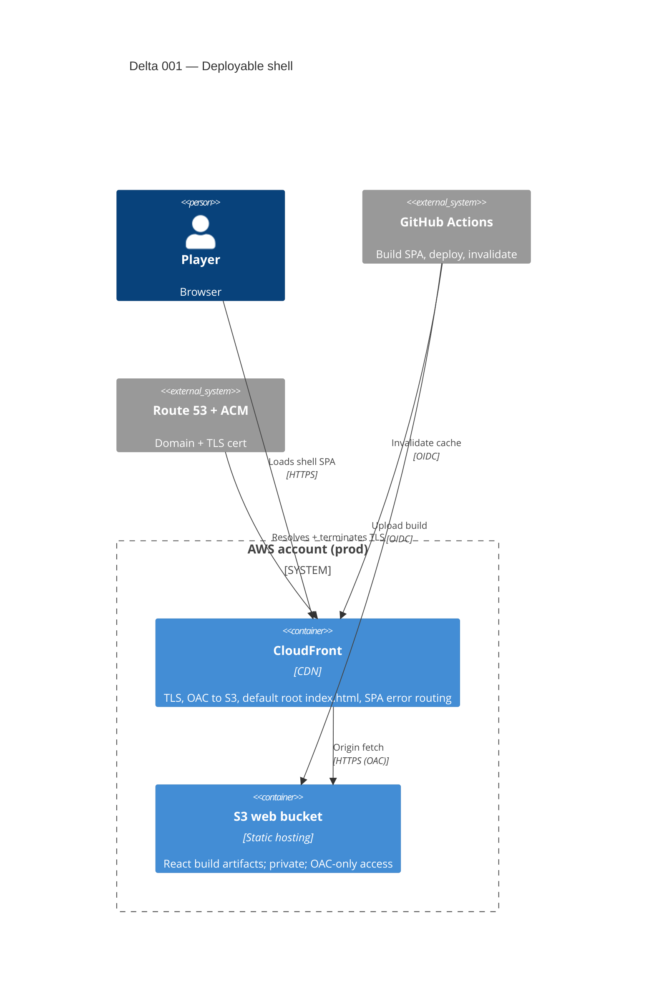

# Delta 001 — Deployable shell (Chunk 1)

## Goal
Prove the production deployment path end-to-end: a real React SPA served at a
real HTTPS URL via a CI/CD pipeline. **No application backend, no database, no
WebSocket.** The shell proves deployment, not gameplay.

## Decision: static SPA only — no backend in Chunk 1
A static React app on CloudFront + S3 fully proves "deployable, always-on, real
URL behind CI/CD." Adding any backend now would be speculative build-ahead
(YAGNI) — the first backend arrives in Chunk 4 with online play.

## Architecture introduced (minimum)

## Resources introduced (and the security note each gets)
1. **S3 web bucket** — private, OAC-only, SSE, no public access block off.
   -> `security/s3-web-bucket.md`
2. **CloudFront distribution** — TLS 1.2+, OAC origin, HTTPS-redirect.
   -> `security/cloudfront-distribution.md`
3. **GitHub OIDC deploy role** (`oxo-deploy`) — repo+branch scoped, least-priv.
   -> `security/iam-deploy-role.md`
4. **Route 53 zone + ACM cert** — DNS + TLS. -> `security/dns-acm.md`

## Explicitly NOT in this delta
API Gateway (HTTP + WS), Lambda functions, DynamoDB tables, WAF, VPC. All arrive
no earlier than Chunk 4.

## Observable acceptance conditions (for `acceptance.md`, co-authored with Product)
- Hitting the production HTTPS URL returns the React shell with a valid TLS cert
  (no browser warning); HTTP redirects to HTTPS.
- The S3 bucket returns 403 to any direct (non-CloudFront) request — content is
  reachable only through the CDN.
- A commit to the deploy branch triggers GitHub Actions which builds the SPA,
  uploads to S3, invalidates CloudFront, and the new content is live — with **no
  long-lived AWS keys** in the repo or CI (OIDC only).
- A client-side route refresh (deep link) returns the SPA, not a 404 (SPA error
  routing configured).
