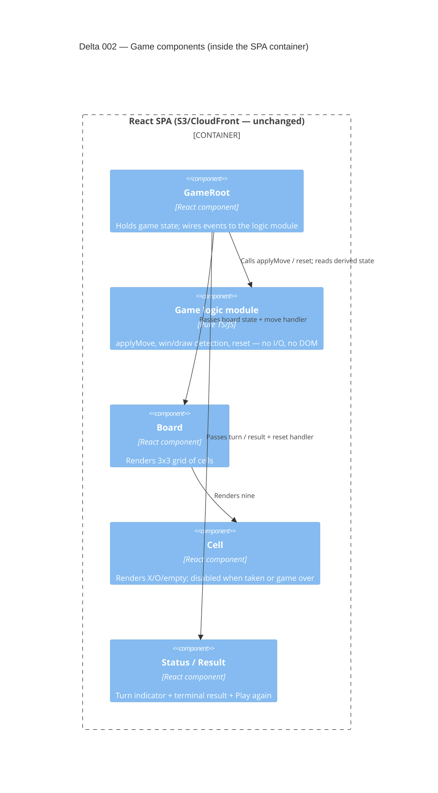

# Delta 002 — Local two-player game (Chunk 2)

## Goal
Replace the placeholder shell with a playable, complete noughts-and-crosses game
for two humans sharing one browser. **All logic is client-side.** This is the
first slice that does something real for a user.

## Decision: pure frontend slice — zero AWS change
The whole game (board, turn alternation, win/draw detection, reset) is React
state in the browser. It ships as a new build of the **existing** SPA through the
**existing** S3 + CloudFront pipeline. No backend is warranted: there is no
shared state, no second client, no persistence. The first backend stays deferred
to Chunk 4 (online play). This is consistent with the target architecture, which
already states Chunks 1–3 ship with **no application backend at all**.

## What changes (application only)

New React code inside the SPA bundle:

- **Game logic module** (pure, framework-free) — owns board representation
  (9-cell array), `currentPlayer`, legal-move check (square empty + game live),
  `applyMove`, win detection over the eight lines, draw detection, and `reset`.
  Pure functions over an immutable state object; no I/O, no DOM, no globals.
- **Board component** — renders the 3×3 grid; each cell is a button that
  dispatches a move for its index.
- **Cell component** — renders X / O / empty; disabled when occupied or game over.
- **Status/turn component** — shows "X's turn" / "O's turn", or the terminal
  result ("X wins" / "O wins" / "Draw").
- **Result + Play again control** — shown on game end; resets to the start state.

State is held at the game-root component; logic lives in the pure module so it is
unit-testable without React.

## What does NOT change
- **Infrastructure:** no S3 bucket, CloudFront, Route 53, or ACM change. Same
  bucket, same distribution, same domain.
- **Pipeline:** no GitHub Actions change beyond shipping the new bundle through
  the existing build/upload/invalidate path.
- **IAM:** no role, policy, or trust-relationship change. `oxo-cf-oac` and
  `oxo-deploy` are untouched. No new principals.
- **Still absent (Chunk 4+):** API Gateway (HTTP + WS), Lambda, DynamoDB, WAF,
  VPC. No data leaves the browser.

## Security review for this delta

Scope of the review is the solution design change only. The delta introduces a
new browser-side feature and **no new infrastructure**, so it is assessed against
new attack surface, data flows, and trust boundaries.

- **New attack surface: none.** The public surface is unchanged — CloudFront in
  front of a private S3 bucket. No new endpoint, port, origin, or listener.
- **New data flows: none.** All game state is in-memory in the user's tab. There
  is no network call, no request to any backend, nothing persisted (no
  localStorage/cookies in scope), nothing transmitted off-device. Closing the
  tab discards everything.
- **New trust boundaries: none.** No new principal, role, or service-to-service
  call. The only trust boundary remains browser ⇄ CloudFront for static asset
  delivery, which is unchanged.
- **Data classification:** the game holds no personal, identifying, or sensitive
  data — only an anonymous in-tab board (X/O/empty). No data-handling controls
  are triggered.
- **Client-side state manipulation:** a user can open dev tools and mutate React
  state or the board array. This is **accepted and in-scope by design** — there
  is no opponent to defraud and no server outcome to protect in a single-browser
  hot-seat game. Game integrity becomes a real control only at Chunk 4, where the
  server becomes authoritative (already specified in `current.md` §"Game
  integrity: server-authoritative"). No control is needed here; cheating affects
  only the cheater's own local game.
- **XSS:** the board renders a fixed, closed set of values (`X`, `O`, empty)
  derived from click position — **no user-supplied text is rendered anywhere**
  (no names, no chat, no free input this slice). Rendering must use React's
  default JSX text interpolation (auto-escaped); `dangerouslySetInnerHTML` must
  not be introduced. This keeps the slice free of any injection sink.
- **Dependencies:** if any new third-party package is added for the UI, it must
  be a pinned, lockfile-tracked dependency and pass the existing CI install/audit
  step. Prefer no new runtime dependency — the game needs none.
- **Cache/headers:** unchanged. The existing CloudFront response headers
  (TLS 1.2+, HTTPS redirect) continue to apply to the new bundle. A CSP is noted
  as a hardening item for when free-text input arrives (Chunk 6/7); not required
  to deliver this slice.

**Conclusion: no new attack surface, no new data flow, no new trust boundary.**
No security-policy test cases are generated for infrastructure this slice. The
two checkable application-level statements that fall out of the review are
recorded in the per-infra note below for the tester to pick up at implementation.

## Per-infrastructure security note
**No new infrastructure — no new infra security note files.** The existing notes
under `architecture/security/` are unaffected by this delta and remain valid.

The two delta-specific, checkable application controls are:
1. No game value renders user-supplied text; the rendered cell set is closed to
   {X, O, empty}, and `dangerouslySetInnerHTML` is absent from the game UI.
2. The game makes no network request — implementation must show zero outbound
   fetch/XHR/WebSocket calls originating from gameplay.

These feed the slice's `acceptance.md` (security-observable conditions) rather
than a new `security/<resource>.md` file, because there is no resource to govern.

## Observable acceptance conditions (technical, co-authored with Product)
Augmenting Product's six functional measures in `slice.md` with the
technical/observable conditions this delta is responsible for:

- The page makes **no network request during gameplay** (board interaction, win,
  draw, reset) other than initial static-asset load — verifiable in the browser
  network panel / Playwright request log.
- Game logic is exercised by **unit tests against the pure module** (win on each
  of the eight lines, draw, illegal-move rejection, reset) with no React/DOM and
  no network — proving the logic is isolated and deterministic.
- The deployed bundle ships through the **existing** pipeline and is live at the
  **same** production URL with no infrastructure or IAM change.
